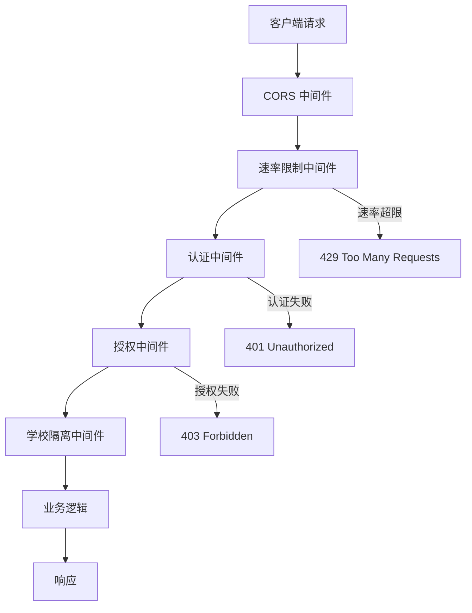
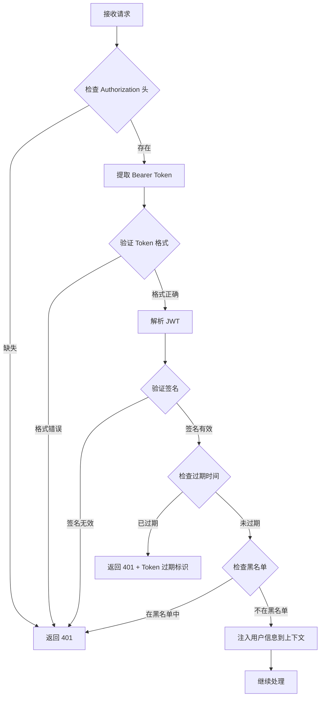
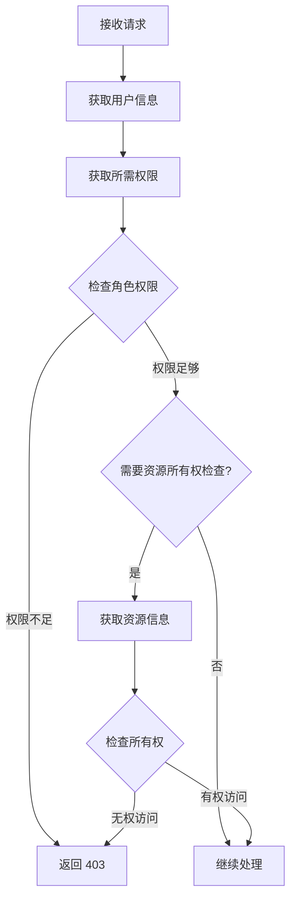

# API 认证中间件设计

> 版本：v1.0  
> 日期：2026-04-30  
> 状态：已批准

---

## 1. 中间件架构

### 1.1 请求处理流程



### 1.2 中间件顺序

| 顺序 | 中间件 | 作用 |
|------|--------|------|
| 1 | CORS | 跨域资源共享 |
| 2 | 速率限制 | 防止暴力攻击 |
| 3 | 认证 | 验证用户身份 |
| 4 | 授权 | 验证用户权限 |
| 5 | 学校隔离 | 确保数据隔离 |

---

## 2. 认证中间件

### 2.1 Token 验证流程



### 2.2 实现代码

```typescript
// FastAPI 认证中间件
from fastapi import Request, HTTPException, Depends
from fastapi.security import HTTPBearer, HTTPAuthorizationCredentials
from jose import JWTError, jwt
from datetime import datetime
import redis

security = HTTPBearer()
redis_client = redis.Redis()

class AuthenticationMiddleware:
    def __init__(self, secret_key: str, algorithm: str = "HS256"):
        self.secret_key = secret_key
        self.algorithm = algorithm
    
    async def __call__(
        self,
        credentials: HTTPAuthorizationCredentials = Depends(security)
    ) -> User:
        """验证 JWT Token 并返回用户信息"""
        
        token = credentials.credentials
        
        try:
            # 1. 解析 JWT
            payload = jwt.decode(
                token,
                self.secret_key,
                algorithms=[self.algorithm]
            )
            
            # 2. 验证必要字段
            user_id = payload.get("sub")
            school_id = payload.get("school_id")
            role = payload.get("role")
            
            if not all([user_id, school_id, role]):
                raise HTTPException(
                    status_code=401,
                    detail="Token 缺少必要字段"
                )
            
            # 3. 检查 Token 是否在黑名单中
            jti = payload.get("jti")
            if jti and await self.is_token_blacklisted(jti):
                raise HTTPException(
                    status_code=401,
                    detail="Token 已被撤销"
                )
            
            # 4. 检查用户是否仍然活跃
            user = await self.get_user(user_id)
            if not user or not user.is_active:
                raise HTTPException(
                    status_code=401,
                    detail="用户不存在或已禁用"
                )
            
            # 5. 返回用户信息
            return User(
                id=user_id,
                school_id=school_id,
                role=role,
                permissions=payload.get("permissions", [])
            )
            
        except JWTError as e:
            raise HTTPException(
                status_code=401,
                detail=f"Token 无效: {str(e)}"
            )
    
    async def is_token_blacklisted(self, jti: str) -> bool:
        """检查 Token 是否在黑名单中"""
        return await redis_client.exists(f"token_blacklist:{jti}")
```

### 2.3 错误响应格式

```typescript
// 认证错误响应
interface AuthErrorResponse {
  status: 401;
  error: "unauthorized";
  message: string;
  details?: {
    code: "TOKEN_MISSING" | "TOKEN_INVALID" | "TOKEN_EXPIRED" | "TOKEN_BLACKLISTED";
    timestamp: string;
  };
}

// 示例响应
{
  "status": 401,
  "error": "unauthorized",
  "message": "Token 已过期",
  "details": {
    "code": "TOKEN_EXPIRED",
    "timestamp": "2026-04-30T12:00:00Z"
  }
}
```

---

## 3. 授权中间件

### 3.1 权限检查流程



### 3.2 实现代码

```typescript
// 权限检查装饰器
from functools import wraps
from fastapi import HTTPException

def require_permission(permission: str):
    """检查用户是否拥有指定权限"""
    def decorator(func):
        @wraps(func)
        async def wrapper(*args, **kwargs):
            # 从上下文获取当前用户
            current_user = get_current_user()
            
            # 检查权限
            if permission not in current_user.permissions:
                raise HTTPException(
                    status_code=403,
                    detail=f"需要权限: {permission}"
                )
            
            return await func(*args, **kwargs)
        return wrapper
    return decorator

def require_role(*roles: str):
    """检查用户是否拥有指定角色"""
    def decorator(func):
        @wraps(func)
        async def wrapper(*args, **kwargs):
            current_user = get_current_user()
            
            if current_user.role not in roles:
                raise HTTPException(
                    status_code=403,
                    detail=f"需要角色: {', '.join(roles)}"
                )
            
            return await func(*args, **kwargs)
        return wrapper
    return decorator

def require_ownership(resource_type: str):
    """检查用户是否拥有资源"""
    def decorator(func):
        @wraps(func)
        async def wrapper(*args, **kwargs):
            current_user = get_current_user()
            resource_id = kwargs.get('resource_id')
            
            # 管理员可以访问所有资源
            if current_user.role == 'admin':
                return await func(*args, **kwargs)
            
            # 检查资源所有权
            resource = await get_resource(resource_type, resource_id)
            if not resource or resource.teacher_id != current_user.id:
                raise HTTPException(
                    status_code=403,
                    detail="无权访问该资源"
                )
            
            return await func(*args, **kwargs)
        return wrapper
    return decorator

# 使用示例
@app.post("/api/v1/activities")
@require_permission("activity:create")
async def create_activity(activity: ActivityCreate):
    """创建活动 - 需要 activity:create 权限"""
    pass

@app.delete("/api/v1/activities/{activity_id}")
@require_permission("activity:delete")
@require_ownership("activity")
async def delete_activity(activity_id: str):
    """删除活动 - 需要 activity:delete 权限和资源所有权"""
    pass

@app.get("/api/v1/admin/users")
@require_role("admin")
async def list_users():
    """列出用户 - 仅管理员"""
    pass
```

---

## 4. 学校隔离中间件

### 4.1 实现代码

```typescript
// 学校隔离中间件
class SchoolIsolationMiddleware:
    async def __call__(self, request: Request, call_next):
        """确保所有查询都包含 school_id 过滤"""
        
        # 从 JWT 中获取 school_id
        user = get_current_user()
        school_id = user.school_id
        
        # 将 school_id 注入到请求上下文
        request.state.school_id = school_id
        
        # 继续处理请求
        response = await call_next(request)
        
        return response

# 数据访问层自动过滤
class BaseRepository:
    def __init__(self, session: AsyncSession, school_id: UUID):
        self.session = session
        self.school_id = school_id
    
    async def get_by_id(self, model, id: UUID):
        """获取资源，自动过滤 school_id"""
        result = await self.session.execute(
            select(model)
            .where(model.id == id)
            .where(model.school_id == self.school_id)
        )
        return result.scalar_one_or_none()
    
    async def get_all(self, model, filters=None):
        """获取所有资源，自动过滤 school_id"""
        query = select(model).where(model.school_id == self.school_id)
        
        if filters:
            query = query.where(filters)
        
        result = await self.session.execute(query)
        return result.scalars().all()
```

---

## 5. 速率限制中间件

### 5.1 限制策略

| 端点类型 | 限制 | 窗口 | 说明 |
|----------|------|------|------|
| 登录 | 5 次 | 15 分钟 | 防止暴力破解 |
| 密码重置 | 3 次 | 1 小时 | 防止滥用 |
| API 读取 | 100 次 | 1 分钟 | 防止爬虫 |
| API 写入 | 30 次 | 1 分钟 | 防止滥用 |
| 文件上传 | 10 次 | 1 分钟 | 防止滥用 |

### 5.2 实现代码

```typescript
// Redis 速率限制
import redis
from fastapi import HTTPException

class RateLimiter:
    def __init__(self, redis_client: redis.Redis):
        self.redis = redis_client
    
    async def check_rate_limit(
        self,
        key: str,
        limit: int,
        window: int
    ) -> bool:
        """检查是否超过速率限制"""
        
        current = await self.redis.get(key)
        
        if current is None:
            # 首次请求
            await self.redis.setex(key, window, 1)
            return True
        
        if int(current) >= limit:
            # 超过限制
            return False
        
        # 增加计数
        await self.redis.incr(key)
        return True

# 速率限制装饰器
def rate_limit(limit: int, window: int, key_func=None):
    """速率限制装饰器"""
    def decorator(func):
        @wraps(func)
        async def wrapper(*args, **kwargs):
            # 生成限制键
            if key_func:
                key = key_func(*args, **kwargs)
            else:
                # 默认使用 IP + 端点
                request = kwargs.get('request')
                key = f"rate_limit:{request.client.host}:{request.url.path}"
            
            # 检查速率限制
            if not await rate_limiter.check_rate_limit(key, limit, window):
                raise HTTPException(
                    status_code=429,
                    detail="请求过于频繁，请稍后再试"
                )
            
            return await func(*args, **kwargs)
        return wrapper
    return decorator

# 使用示例
@app.post("/api/v1/auth/login")
@rate_limit(limit=5, window=900)  # 15 分钟内最多 5 次
async def login(credentials: LoginRequest):
    """登录接口 - 严格速率限制"""
    pass

@app.get("/api/v1/activities")
@rate_limit(limit=100, window=60)  # 1 分钟内最多 100 次
async def list_activities():
    """列出活动 - 标准速率限制"""
    pass
```

---

## 6. 请求日志中间件

### 6.1 日志格式

```typescript
// 请求日志
interface RequestLog {
  timestamp: string;
  request_id: string;
  method: string;
  path: string;
  query: Record<string, string>;
  user_id?: string;
  school_id?: string;
  ip_address: string;
  user_agent: string;
  status_code: number;
  response_time_ms: number;
  error?: string;
}
```

### 6.2 实现代码

```typescript
// 请求日志中间件
import time
import uuid
from fastapi import Request

class RequestLoggingMiddleware:
    async def __call__(self, request: Request, call_next):
        # 生成请求 ID
        request_id = str(uuid.uuid4())
        request.state.request_id = request_id
        
        # 记录开始时间
        start_time = time.time()
        
        # 处理请求
        try:
            response = await call_next(request)
            
            # 计算响应时间
            process_time = (time.time() - start_time) * 1000
            
            # 记录日志
            await self.log_request(
                request_id=request_id,
                method=request.method,
                path=request.url.path,
                query=dict(request.query_params),
                status_code=response.status_code,
                response_time_ms=process_time,
                ip_address=request.client.host,
                user_agent=request.headers.get("user-agent")
            )
            
            # 添加请求 ID 到响应头
            response.headers["X-Request-ID"] = request_id
            
            return response
            
        except Exception as e:
            # 记录错误
            await self.log_error(request_id, str(e))
            raise
```

---

## 7. CORS 配置

### 7.1 配置示例

```typescript
// CORS 中间件配置
from fastapi.middleware.cors import CORSMiddleware

app.add_middleware(
    CORSMiddleware,
    allow_origins=[
        "https://thinking-tree.example.com",
        "https://admin.thinking-tree.example.com"
    ],
    allow_credentials=True,
    allow_methods=["GET", "POST", "PUT", "DELETE", "OPTIONS"],
    allow_headers=["Authorization", "Content-Type", "X-Request-ID"],
    expose_headers=["X-Request-ID"],
    max_age=600  # 预检请求缓存 10 分钟
)
```

---

## 8. 错误处理

### 8.1 统一错误响应格式

```typescript
// 错误响应
interface ErrorResponse {
  status: number;
  error: string;
  message: string;
  details?: {
    code: string;
    field?: string;
    timestamp: string;
    request_id?: string;
  };
}

// 错误码定义
enum ErrorCode {
  // 认证错误 (401)
  TOKEN_MISSING = "TOKEN_MISSING",
  TOKEN_INVALID = "TOKEN_INVALID",
  TOKEN_EXPIRED = "TOKEN_EXPIRED",
  TOKEN_BLACKLISTED = "TOKEN_BLACKLISTED",
  INVALID_CREDENTIALS = "INVALID_CREDENTIALS",
  ACCOUNT_LOCKED = "ACCOUNT_LOCKED",
  
  // 授权错误 (403)
  PERMISSION_DENIED = "PERMISSION_DENIED",
  ROLE_REQUIRED = "ROLE_REQUIRED",
  OWNERSHIP_REQUIRED = "OWNERSHIP_REQUIRED",
  
  // 速率限制 (429)
  RATE_LIMIT_EXCEEDED = "RATE_LIMIT_EXCEEDED",
  
  // 资源错误 (404)
  RESOURCE_NOT_FOUND = "RESOURCE_NOT_FOUND",
  SCHOOL_NOT_FOUND = "SCHOOL_NOT_FOUND",
  
  // 服务器错误 (500)
  INTERNAL_ERROR = "INTERNAL_ERROR"
}
```

### 8.2 全局异常处理

```typescript
// 全局异常处理器
from fastapi import FastAPI, Request
from fastapi.responses import JSONResponse

app = FastAPI()

@app.exception_handler(HTTPException)
async def http_exception_handler(request: Request, exc: HTTPException):
    return JSONResponse(
        status_code=exc.status_code,
        content={
            "status": exc.status_code,
            "error": "error",
            "message": exc.detail,
            "details": {
                "timestamp": datetime.utcnow().isoformat(),
                "request_id": request.state.request_id
            }
        }
    )

@app.exception_handler(Exception)
async def general_exception_handler(request: Request, exc: Exception):
    # 记录错误日志
    logger.error(f"Unhandled exception: {str(exc)}", exc_info=True)
    
    return JSONResponse(
        status_code=500,
        content={
            "status": 500,
            "error": "internal_error",
            "message": "服务器内部错误",
            "details": {
                "timestamp": datetime.utcnow().isoformat(),
                "request_id": request.state.request_id
            }
        }
    )
```

---

## 9. 总结

| 中间件 | 作用 | 关键配置 |
|--------|------|----------|
| CORS | 跨域资源共享 | 白名单域名 |
| 速率限制 | 防止暴力攻击 | 5 次/15 分钟（登录） |
| 认证 | 验证用户身份 | JWT + 黑名单 |
| 授权 | 验证用户权限 | 角色 + 权限 + 所有权 |
| 学校隔离 | 确保数据隔离 | school_id 过滤 |
| 日志 | 记录请求信息 | 请求 ID + 响应时间 |
