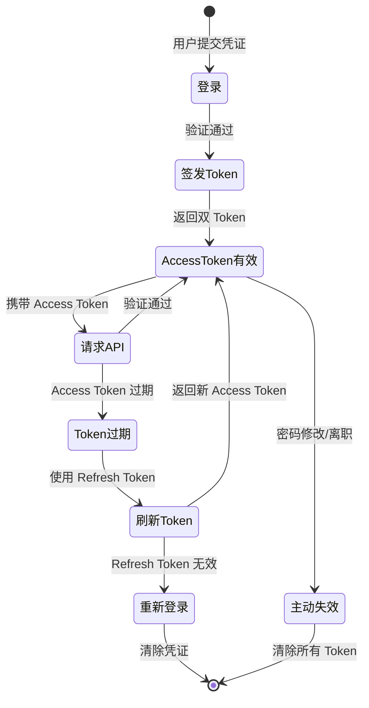

# 认证架构决策文档

> 版本：v1.0  
> 日期：2026-04-30  
> 状态：已批准

---

## 1. 背景

儿童思维树系统需要为教师和学校提供安全的身份认证机制。系统涉及多学校部署、教师权限管理、课堂实时互动等场景，需要选择合适的认证架构。

---

## 2. 候选方案对比

### 2.1 JWT（JSON Web Token）

**工作原理：**
- 用户登录后，服务器生成签名的 JWT Token
- Token 包含用户身份、角色、学校等声明（Claims）
- 客户端在每次请求时携带 Token
- 服务器验证 Token 签名，无需查询数据库

**优点：**

| 优点 | 说明 |
|------|------|
| 无状态 | 服务器不需要存储会话信息，易于水平扩展 |
| 跨服务 | 微服务架构下可直接验证 Token |
| 性能 | 减少数据库查询，适合高并发场景 |
| 移动端友好 | 天然支持移动端和 SPA 应用 |

**缺点：**

| 缺点 | 说明 |
|------|------|
| 无法主动失效 | Token 一旦签发，在过期前无法撤销 |
| Token 体积 | 包含用户信息，体积较大 |
| 安全风险 | 需要妥善保管密钥，Token 泄露风险 |
| 续期复杂 | 需要额外的刷新机制 |

### 2.2 Session-Based 认证

**工作原理：**
- 用户登录后，服务器创建会话并存储在数据库/缓存
- 客户端仅持有 Session ID（通常在 Cookie 中）
- 每次请求需要查询会话存储

**优点：**

| 优点 | 说明 |
|------|------|
| 可控性强 | 服务器可随时撤销会话 |
| 安全性 | Session ID 无意义，泄露风险较低 |
| 实现简单 | 传统 Web 应用成熟方案 |
| 自动续期 | 可在每次请求时刷新有效期 |

**缺点：**

| 缺点 | 说明 |
|------|------|
| 有状态 | 需要共享会话存储，增加运维复杂度 |
| 扩展性 | 水平扩展需要共享会话状态 |
| 性能 | 每次请求需要查询会话存储 |

---

## 3. 推荐方案：JWT + 短期 Token + 刷新机制

### 3.1 决策理由

针对儿童思维树系统的场景特点：

| 场景特点 | 影响 |
|----------|------|
| 课堂实时互动 | 需要低延迟认证，减少数据库查询 |
| 多学校部署 | 需要跨服务认证能力 |
| 教师权限管理 | 需要包含角色和学校信息 |
| 安全敏感 | 需要可控的会话生命周期 |

**推荐采用 JWT 方案**，并结合以下安全措施：

1. **短期 Access Token**：15 分钟有效期
2. **长期 Refresh Token**：7 天有效期，存储在 HttpOnly Cookie
3. **Token 黑名单**：用于主动失效（教师离职、密码修改等场景）

### 3.2 Token 设计

```typescript
// Access Token Payload
interface AccessTokenPayload {
  // 标准声明
  sub: string;           // 用户 ID
  iat: number;           // 签发时间
  exp: number;           // 过期时间
  iss: string;           // 签发者
  
  // 自定义声明
  role: 'admin' | 'teacher' | 'observer';
  schoolId: string;      // 学校 ID
  teacherId: string;     // 教师 ID
  permissions: string[]; // 权限列表
}

// Refresh Token Payload
interface RefreshTokenPayload {
  sub: string;           // 用户 ID
  iat: number;           // 签发时间
  exp: number;           // 过期时间
  family: string;        // Token 家族 ID（用于检测重放攻击）
}
```

### 3.3 Token 生命周期



### 3.4 Token 存储策略

| Token 类型 | 存储位置 | 有效期 | 说明 |
|------------|----------|--------|------|
| Access Token | 内存 / LocalStorage | 15 分钟 | 短期有效，泄露影响有限 |
| Refresh Token | HttpOnly Cookie | 7 天 | 防 XSS，支持自动续期 |

### 3.5 Token 黑名单机制

用于主动失效场景：

```typescript
// Redis 存储黑名单
interface TokenBlacklist {
  jti: string;           // Token ID
  exp: number;           // 过期时间（自动清理）
  reason: 'logout' | 'password_change' | 'account_disabled';
}
```

**触发场景：**
- 教师主动登出
- 修改密码
- 账户被禁用
- 检测到异常登录

---

## 4. 安全增强措施

### 4.1 密码安全

| 措施 | 说明 |
|------|------|
| 哈希算法 | bcrypt，cost factor = 12 |
| 密码策略 | 最少 8 位，包含大小写字母和数字 |
| 密码历史 | 不允许使用最近 5 次的密码 |

### 4.2 登录安全

| 措施 | 说明 |
|------|------|
| 登录失败锁定 | 连续 5 次失败后锁定 15 分钟 |
| IP 限制 | 可选：限制学校 IP 范围 |
| 双因素认证 | 可选：支持 TOTP |

### 4.3 会话安全

| 措施 | 说明 |
|------|------|
| 设备绑定 | 首次登录需验证设备 |
| 并发限制 | 同一账户最多 3 个活跃会话 |
| 异常检测 | 检测异地登录、频繁切换 |

---

## 5. 实现建议

### 5.1 技术栈

| 组件 | 推荐方案 |
|------|----------|
| JWT 库 | `python-jose` (FastAPI) 或 `jsonwebtoken` (Node.js) |
| 密码哈希 | `bcrypt` 或 `argon2` |
| Token 存储 | Redis（黑名单） |
| 会话管理 | Redis（可选，用于并发控制） |

### 5.2 配置参数

```yaml
# 认证配置
auth:
  jwt:
    secret_key: ${JWT_SECRET_KEY}
    algorithm: HS256
    access_token_expire_minutes: 15
    refresh_token_expire_days: 7
    issuer: "thinking-tree"
  
  password:
    min_length: 8
    require_uppercase: true
    require_lowercase: true
    require_digit: true
    history_count: 5
    bcrypt_cost: 12
  
  login:
    max_attempts: 5
    lockout_minutes: 15
    max_concurrent_sessions: 3
```

---

## 6. 总结

| 决策项 | 选择 | 理由 |
|--------|------|------|
| 认证方式 | JWT | 无状态、跨服务、性能好 |
| Access Token 有效期 | 15 分钟 | 平衡安全性和用户体验 |
| Refresh Token 有效期 | 7 天 | 教师日常使用周期 |
| Token 存储 | HttpOnly Cookie | 防 XSS 攻击 |
| 主动失效 | Token 黑名单 | 支持紧急场景 |

---

## 7. 参考资料

- [OWASP JWT Cheat Sheet](https://cheatsheetseries.owasp.org/cheatsheets/JSON_Web_Token_for_Java_Cheat_Sheet.html)
- [RFC 7519 - JSON Web Token](https://tools.ietf.org/html/rfc7519)
- [Auth0 - JWT Best Practices](https://auth0.com/blog/ten-things-you-should-know-about-tokens-and-cookies/)
