# 认证流程图

> 版本：v1.0  
> 日期：2026-04-30  
> 状态：已批准

---

## 1. 登录流程

### 1.1 教师登录流程

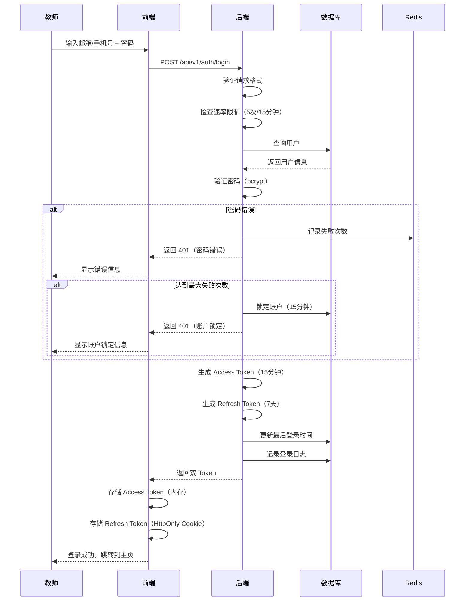
```mermaid
sequenceDiagram
    participant U as 教师
    participant FE as 前端
    participant BE as 后端
    participant DB as 数据库
    participant Redis as Redis
    
    U->>FE: 输入邮箱/手机号 + 密码
    FE->>BE: POST /api/v1/auth/login
    
    BE->>BE: 验证请求格式
    BE->>BE: 检查速率限制（5次/15分钟）
    
    BE->>DB: 查询用户
    DB-->>BE: 返回用户信息
    
    BE->>BE: 验证密码（bcrypt）
    
    alt 密码错误
        BE->>Redis: 记录失败次数
        BE-->>FE: 返回 401（密码错误）
        FE-->>U: 显示错误信息
        
        alt 达到最大失败次数
            BE->>DB: 锁定账户（15分钟）
            BE-->>FE: 返回 401（账户锁定）
            FE-->>U: 显示账户锁定信息
        end
    end
    
    BE->>BE: 生成 Access Token（15分钟）
    BE->>BE: 生成 Refresh Token（7天）
    
    BE->>DB: 更新最后登录时间
    BE->>DB: 记录登录日志
    
    BE-->>FE: 返回双 Token
    FE->>FE: 存储 Access Token（内存）
    FE->>FE: 存储 Refresh Token（HttpOnly Cookie）
    FE-->>U: 登录成功，跳转到主页
```

### 1.2 学校管理员登录流程

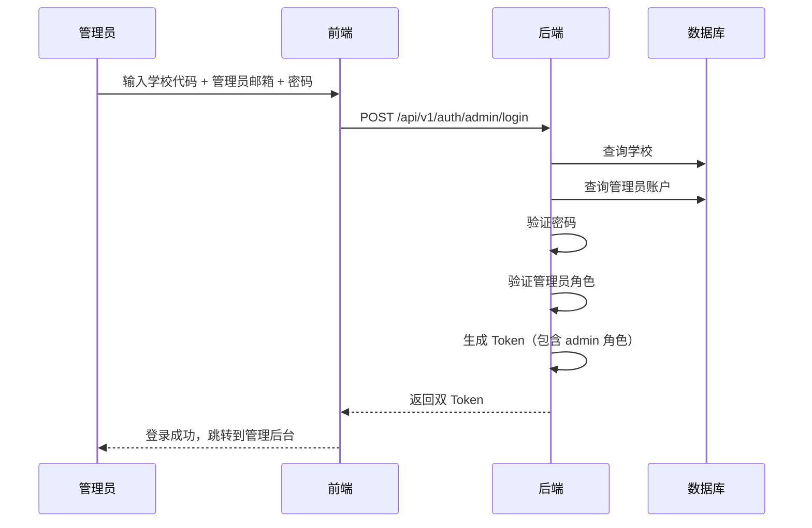
```mermaid
sequenceDiagram
    participant U as 管理员
    participant FE as 前端
    participant BE as 后端
    participant DB as 数据库
    
    U->>FE: 输入学校代码 + 管理员邮箱 + 密码
    FE->>BE: POST /api/v1/auth/admin/login
    
    BE->>DB: 查询学校
    BE->>DB: 查询管理员账户
    
    BE->>BE: 验证密码
    BE->>BE: 验证管理员角色
    
    BE->>BE: 生成 Token（包含 admin 角色）
    
    BE-->>FE: 返回双 Token
    FE-->>U: 登录成功，跳转到管理后台
```

---

## 2. Token 刷新流程

### 2.1 自动刷新流程

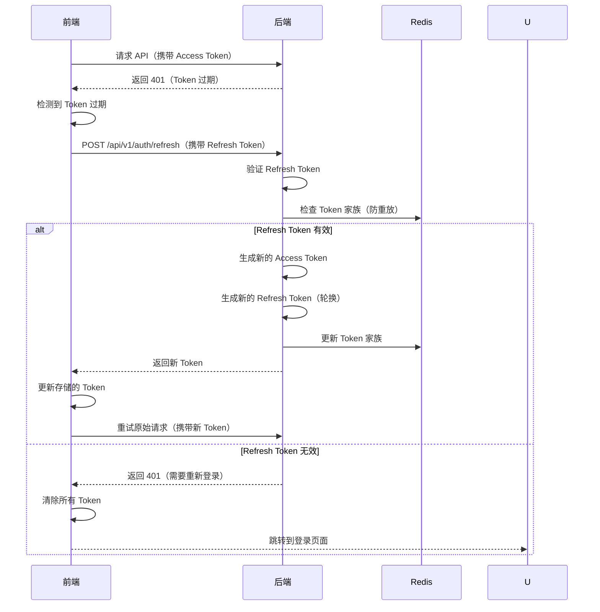
```mermaid
sequenceDiagram
    participant FE as 前端
    participant BE as 后端
    participant Redis as Redis
    
    FE->>BE: 请求 API（携带 Access Token）
    BE-->>FE: 返回 401（Token 过期）
    
    FE->>FE: 检测到 Token 过期
    FE->>BE: POST /api/v1/auth/refresh（携带 Refresh Token）
    
    BE->>BE: 验证 Refresh Token
    BE->>Redis: 检查 Token 家族（防重放）
    
    alt Refresh Token 有效
        BE->>BE: 生成新的 Access Token
        BE->>BE: 生成新的 Refresh Token（轮换）
        BE->>Redis: 更新 Token 家族
        BE-->>FE: 返回新 Token
        FE->>FE: 更新存储的 Token
        FE->>BE: 重试原始请求（携带新 Token）
    else Refresh Token 无效
        BE-->>FE: 返回 401（需要重新登录）
        FE->>FE: 清除所有 Token
        FE-->>U: 跳转到登录页面
    end
```

### 2.2 Token 轮换机制

```mermaid
stateDiagram-v2
    [*] --> RefreshToken_1: 登录签发
    
    RefreshToken_1 --> RefreshToken_2: 第一次刷新
    RefreshToken_2 --> RefreshToken_3: 第二次刷新
    
    RefreshToken_1 --> [*]: 检测到重放攻击
    RefreshToken_2 --> [*]: 检测到重放攻击
    RefreshToken_3 --> [*]: 过期
    
    note right of RefreshToken_1: 家族 ID: family_123
    note right of RefreshToken_2: 家族 ID: family_123
    note right of RefreshToken_3: 家族 ID: family_123
```

---

## 3. 密码重置流程

### 3.1 忘记密码流程

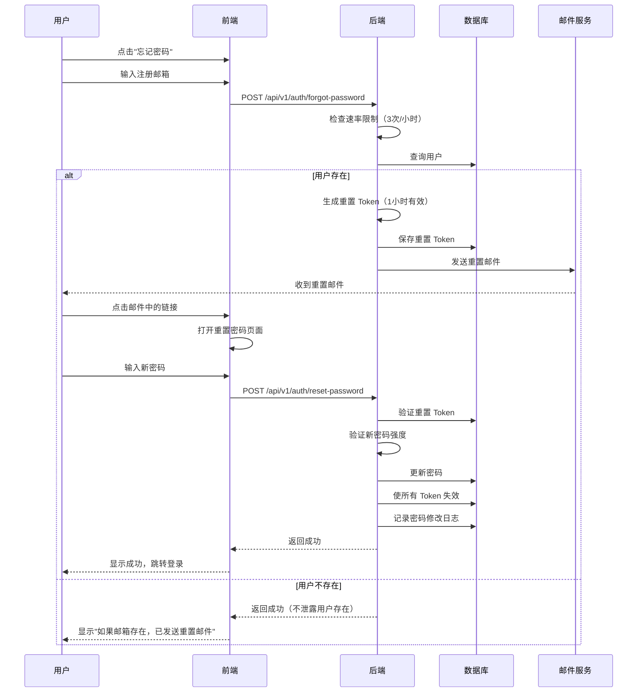
```mermaid
sequenceDiagram
    participant U as 用户
    participant FE as 前端
    participant BE as 后端
    participant DB as 数据库
    participant Email as 邮件服务
    
    U->>FE: 点击"忘记密码"
    U->>FE: 输入注册邮箱
    FE->>BE: POST /api/v1/auth/forgot-password
    
    BE->>BE: 检查速率限制（3次/小时）
    BE->>DB: 查询用户
    
    alt 用户存在
        BE->>BE: 生成重置 Token（1小时有效）
        BE->>DB: 保存重置 Token
        
        BE->>Email: 发送重置邮件
        Email-->>U: 收到重置邮件
        
        U->>FE: 点击邮件中的链接
        FE->>FE: 打开重置密码页面
        
        U->>FE: 输入新密码
        FE->>BE: POST /api/v1/auth/reset-password
        
        BE->>DB: 验证重置 Token
        BE->>BE: 验证新密码强度
        BE->>DB: 更新密码
        BE->>DB: 使所有 Token 失效
        BE->>DB: 记录密码修改日志
        
        BE-->>FE: 返回成功
        FE-->>U: 显示成功，跳转登录
    else 用户不存在
        BE-->>FE: 返回成功（不泄露用户存在）
        FE-->>U: 显示"如果邮箱存在，已发送重置邮件"
    end
```

### 3.2 管理员重置密码流程

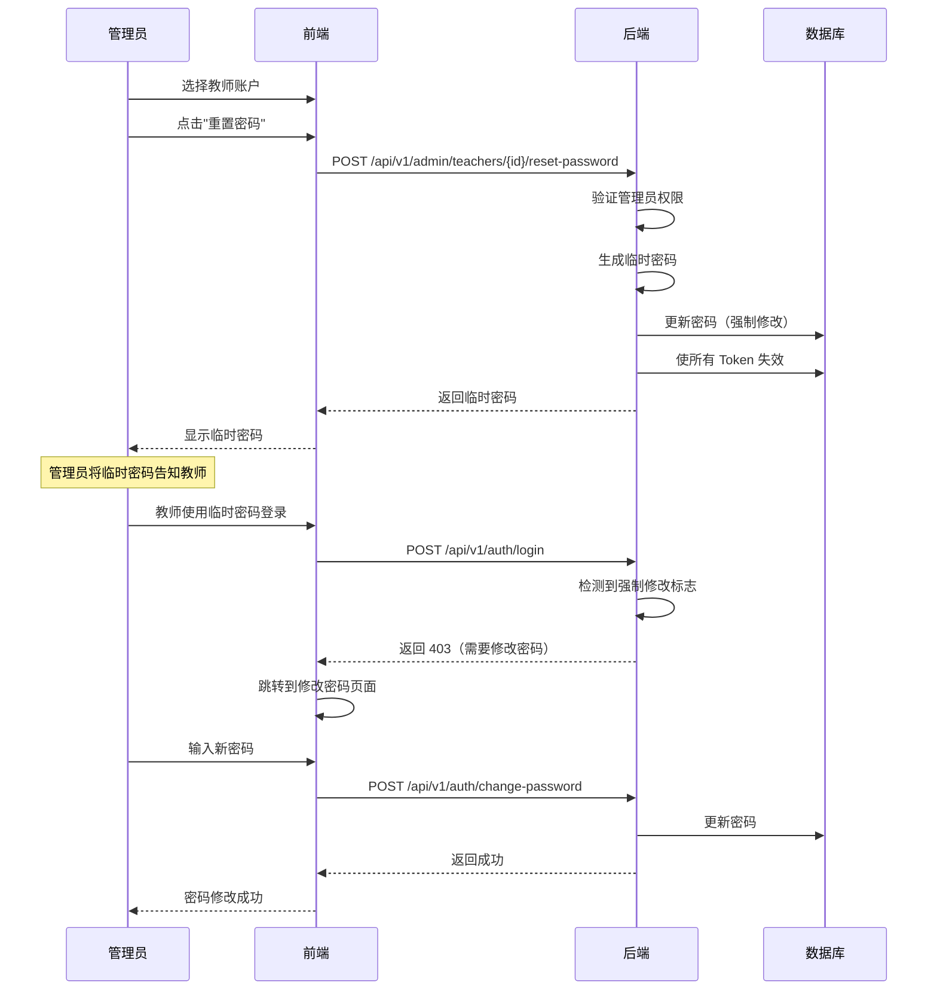
```mermaid
sequenceDiagram
    participant A as 管理员
    participant FE as 前端
    participant BE as 后端
    participant DB as 数据库
    
    A->>FE: 选择教师账户
    A->>FE: 点击"重置密码"
    FE->>BE: POST /api/v1/admin/teachers/{id}/reset-password
    
    BE->>BE: 验证管理员权限
    BE->>BE: 生成临时密码
    BE->>DB: 更新密码（强制修改）
    BE->>DB: 使所有 Token 失效
    
    BE-->>FE: 返回临时密码
    FE-->>A: 显示临时密码
    
    Note over A: 管理员将临时密码告知教师
    
    A->>FE: 教师使用临时密码登录
    FE->>BE: POST /api/v1/auth/login
    
    BE->>BE: 检测到强制修改标志
    BE-->>FE: 返回 403（需要修改密码）
    
    FE->>FE: 跳转到修改密码页面
    
    A->>FE: 输入新密码
    FE->>BE: POST /api/v1/auth/change-password
    BE->>DB: 更新密码
    BE-->>FE: 返回成功
    FE-->>A: 密码修改成功
```

---

## 4. 会话管理流程

### 4.1 并发会话控制

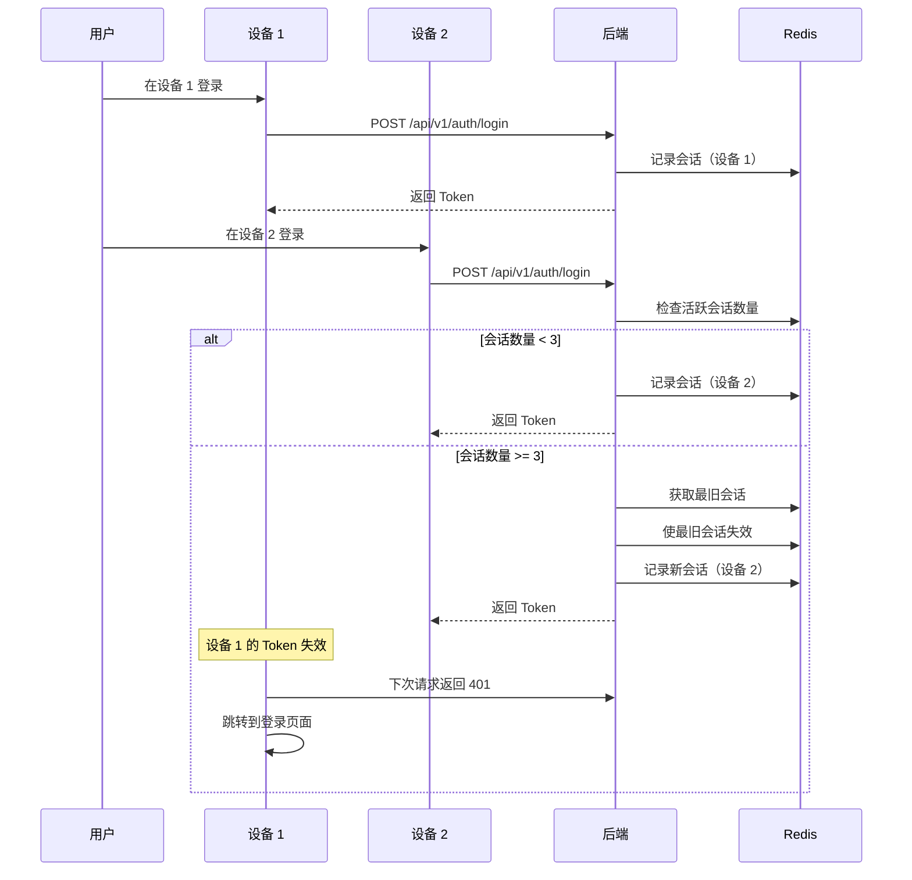
```mermaid
sequenceDiagram
    participant U as 用户
    participant D1 as 设备 1
    participant D2 as 设备 2
    participant BE as 后端
    participant Redis as Redis
    
    U->>D1: 在设备 1 登录
    D1->>BE: POST /api/v1/auth/login
    BE->>Redis: 记录会话（设备 1）
    BE-->>D1: 返回 Token
    
    U->>D2: 在设备 2 登录
    D2->>BE: POST /api/v1/auth/login
    BE->>Redis: 检查活跃会话数量
    
    alt 会话数量 < 3
        BE->>Redis: 记录会话（设备 2）
        BE-->>D2: 返回 Token
    else 会话数量 >= 3
        BE->>Redis: 获取最旧会话
        BE->>Redis: 使最旧会话失效
        BE->>Redis: 记录新会话（设备 2）
        BE-->>D2: 返回 Token
        
        Note over D1: 设备 1 的 Token 失效
        D1->>BE: 下次请求返回 401
        D1->>D1: 跳转到登录页面
    end
```

### 4.2 异地登录检测

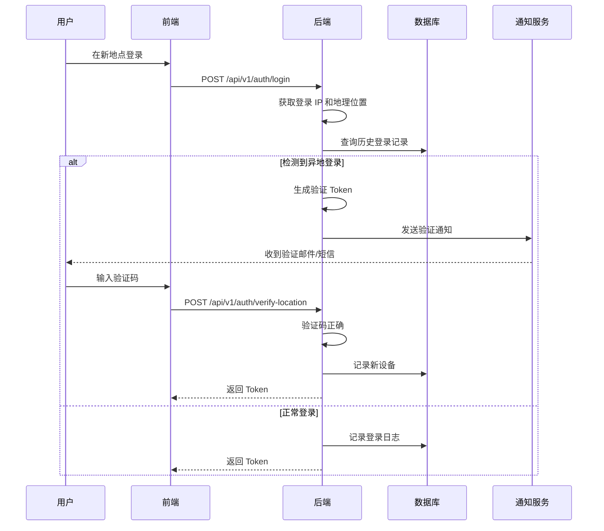
```mermaid
sequenceDiagram
    participant U as 用户
    participant FE as 前端
    participant BE as 后端
    participant DB as 数据库
    participant Notify as 通知服务
    
    U->>FE: 在新地点登录
    FE->>BE: POST /api/v1/auth/login
    
    BE->>BE: 获取登录 IP 和地理位置
    BE->>DB: 查询历史登录记录
    
    alt 检测到异地登录
        BE->>BE: 生成验证 Token
        BE->>Notify: 发送验证通知
        Notify-->>U: 收到验证邮件/短信
        
        U->>FE: 输入验证码
        FE->>BE: POST /api/v1/auth/verify-location
        
        BE->>BE: 验证码正确
        BE->>DB: 记录新设备
        BE-->>FE: 返回 Token
    else 正常登录
        BE->>DB: 记录登录日志
        BE-->>FE: 返回 Token
    end
```

---

## 5. 登出流程

### 5.1 主动登出流程

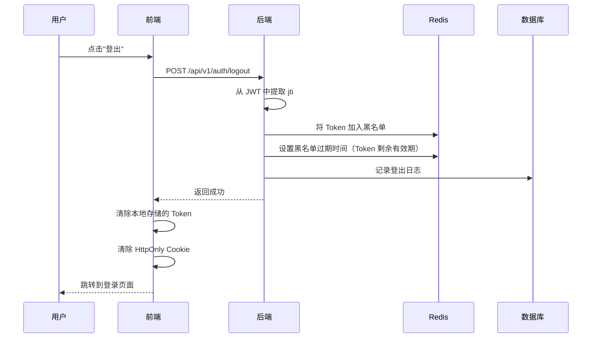
```mermaid
sequenceDiagram
    participant U as 用户
    participant FE as 前端
    participant BE as 后端
    participant Redis as Redis
    participant DB as 数据库
    
    U->>FE: 点击"登出"
    FE->>BE: POST /api/v1/auth/logout
    
    BE->>BE: 从 JWT 中提取 jti
    BE->>Redis: 将 Token 加入黑名单
    BE->>Redis: 设置黑名单过期时间（Token 剩余有效期）
    
    BE->>DB: 记录登出日志
    
    BE-->>FE: 返回成功
    FE->>FE: 清除本地存储的 Token
    FE->>FE: 清除 HttpOnly Cookie
    FE-->>U: 跳转到登录页面
```

### 5.2 强制登出流程（管理员操作）

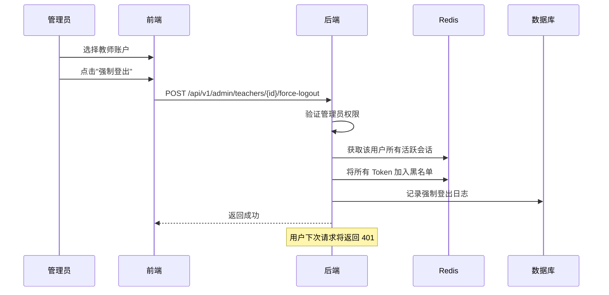
```mermaid
sequenceDiagram
    participant A as 管理员
    participant FE as 前端
    participant BE as 后端
    participant Redis as Redis
    participant DB as 数据库
    
    A->>FE: 选择教师账户
    A->>FE: 点击"强制登出"
    FE->>BE: POST /api/v1/admin/teachers/{id}/force-logout
    
    BE->>BE: 验证管理员权限
    BE->>Redis: 获取该用户所有活跃会话
    BE->>Redis: 将所有 Token 加入黑名单
    
    BE->>DB: 记录强制登出日志
    
    BE-->>FE: 返回成功
    
    Note over BE: 用户下次请求将返回 401
```

### 5.3 全局登出流程（安全事件）

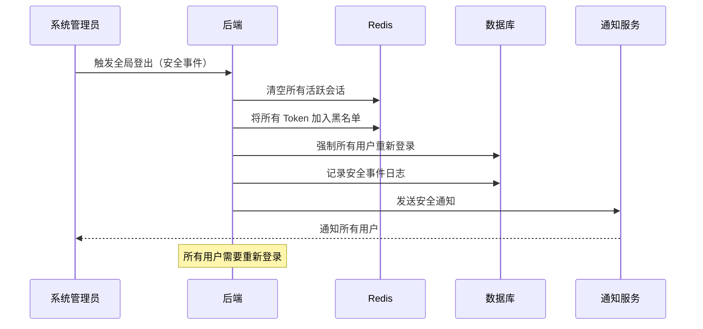
```mermaid
sequenceDiagram
    participant Admin as 系统管理员
    participant BE as 后端
    participant Redis as Redis
    participant DB as 数据库
    participant Notify as 通知服务
    
    Admin->>BE: 触发全局登出（安全事件）
    
    BE->>Redis: 清空所有活跃会话
    BE->>Redis: 将所有 Token 加入黑名单
    
    BE->>DB: 强制所有用户重新登录
    BE->>DB: 记录安全事件日志
    
    BE->>Notify: 发送安全通知
    Notify-->>Admin: 通知所有用户
    
    Note over BE: 所有用户需要重新登录
```

---

## 6. 设备管理流程

### 6.1 新设备登录流程

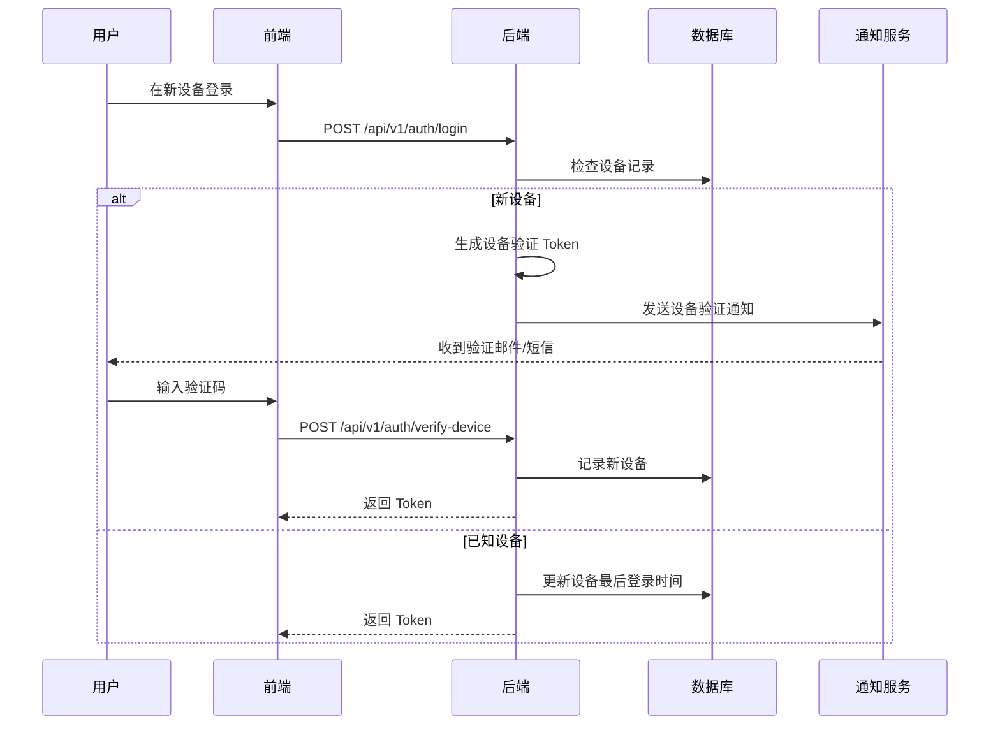
```mermaid
sequenceDiagram
    participant U as 用户
    participant FE as 前端
    participant BE as 后端
    participant DB as 数据库
    participant Notify as 通知服务
    
    U->>FE: 在新设备登录
    FE->>BE: POST /api/v1/auth/login
    
    BE->>DB: 检查设备记录
    
    alt 新设备
        BE->>BE: 生成设备验证 Token
        BE->>Notify: 发送设备验证通知
        Notify-->>U: 收到验证邮件/短信
        
        U->>FE: 输入验证码
        FE->>BE: POST /api/v1/auth/verify-device
        
        BE->>DB: 记录新设备
        BE-->>FE: 返回 Token
    else 已知设备
        BE->>DB: 更新设备最后登录时间
        BE-->>FE: 返回 Token
    end
```

### 6.2 设备管理界面流程

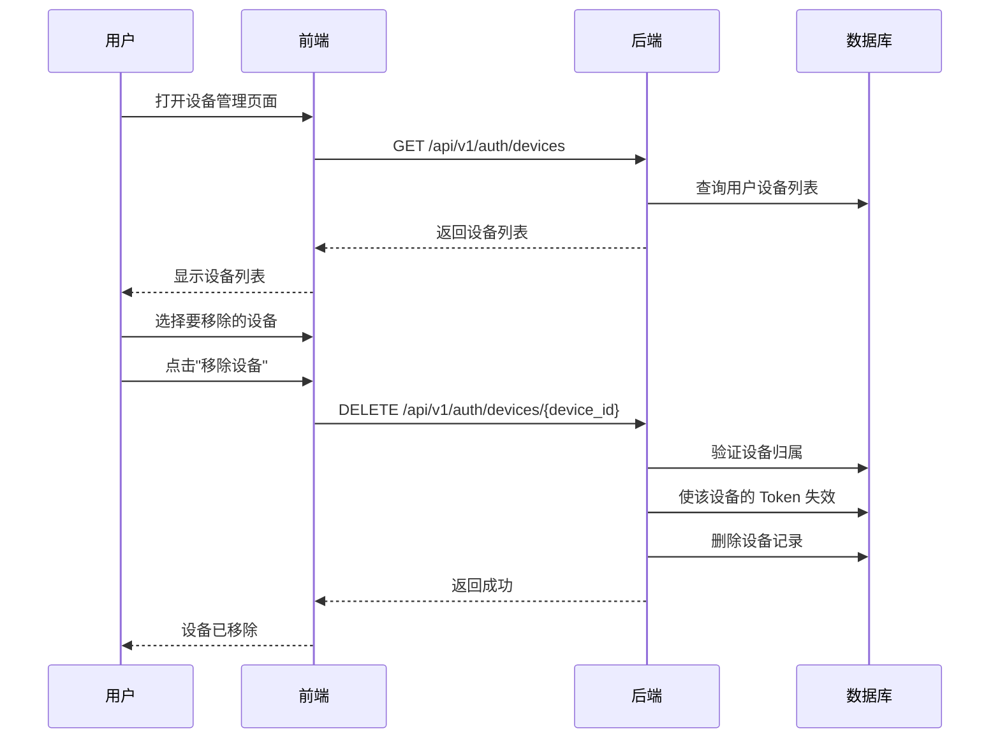
```mermaid
sequenceDiagram
    participant U as 用户
    participant FE as 前端
    participant BE as 后端
    participant DB as 数据库
    
    U->>FE: 打开设备管理页面
    FE->>BE: GET /api/v1/auth/devices
    
    BE->>DB: 查询用户设备列表
    BE-->>FE: 返回设备列表
    
    FE-->>U: 显示设备列表
    
    U->>FE: 选择要移除的设备
    U->>FE: 点击"移除设备"
    FE->>BE: DELETE /api/v1/auth/devices/{device_id}
    
    BE->>DB: 验证设备归属
    BE->>DB: 使该设备的 Token 失效
    BE->>DB: 删除设备记录
    
    BE-->>FE: 返回成功
    FE-->>U: 设备已移除
```

---

## 7. 双因素认证流程（可选）

### 7.1 启用双因素认证

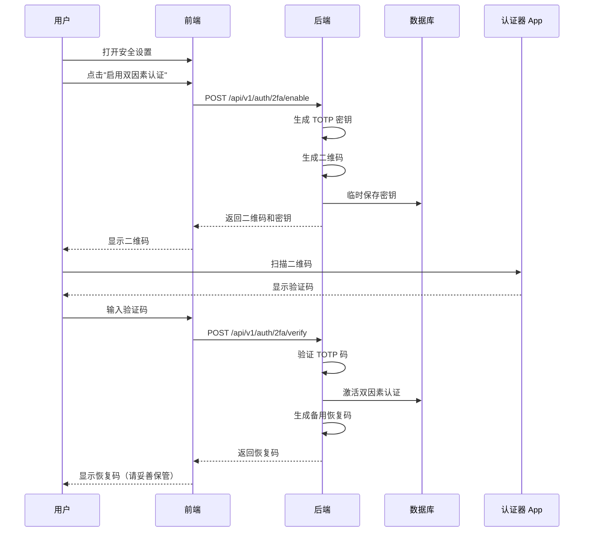
```mermaid
sequenceDiagram
    participant U as 用户
    participant FE as 前端
    participant BE as 后端
    participant DB as 数据库
    participant TOTP as 认证器 App
    
    U->>FE: 打开安全设置
    U->>FE: 点击"启用双因素认证"
    FE->>BE: POST /api/v1/auth/2fa/enable
    
    BE->>BE: 生成 TOTP 密钥
    BE->>BE: 生成二维码
    BE->>DB: 临时保存密钥
    
    BE-->>FE: 返回二维码和密钥
    FE-->>U: 显示二维码
    
    U->>TOTP: 扫描二维码
    TOTP-->>U: 显示验证码
    
    U->>FE: 输入验证码
    FE->>BE: POST /api/v1/auth/2fa/verify
    
    BE->>BE: 验证 TOTP 码
    BE->>DB: 激活双因素认证
    BE->>BE: 生成备用恢复码
    
    BE-->>FE: 返回恢复码
    FE-->>U: 显示恢复码（请妥善保管）
```

### 7.2 双因素认证登录流程

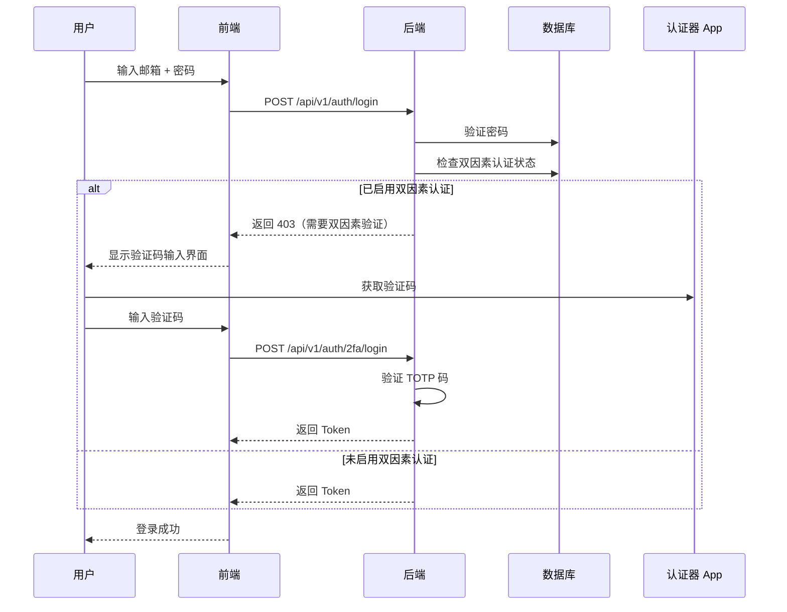
```mermaid
sequenceDiagram
    participant U as 用户
    participant FE as 前端
    participant BE as 后端
    participant DB as 数据库
    participant TOTP as 认证器 App
    
    U->>FE: 输入邮箱 + 密码
    FE->>BE: POST /api/v1/auth/login
    
    BE->>DB: 验证密码
    BE->>DB: 检查双因素认证状态
    
    alt 已启用双因素认证
        BE-->>FE: 返回 403（需要双因素验证）
        FE-->>U: 显示验证码输入界面
        
        U->>TOTP: 获取验证码
        U->>FE: 输入验证码
        FE->>BE: POST /api/v1/auth/2fa/login
        
        BE->>BE: 验证 TOTP 码
        BE-->>FE: 返回 Token
    else 未启用双因素认证
        BE-->>FE: 返回 Token
    end
    
    FE-->>U: 登录成功
```

---

## 8. 总结

| 流程 | 关键步骤 | 安全措施 |
|------|----------|----------|
| 登录 | 验证凭证 → 生成 Token | 速率限制、账户锁定 |
| Token 刷新 | 验证 Refresh Token → 轮换 | Token 家族、重放检测 |
| 密码重置 | 发送重置邮件 → 验证 Token | 速率限制、Token 有效期 |
| 会话管理 | 并发控制、异地检测 | 最大会话数、设备绑定 |
| 登出 | Token 加入黑名单 | 主动失效、强制登出 |
| 设备管理 | 设备验证、设备移除 | 新设备验证、Token 失效 |
| 双因素认证 | TOTP 验证 | 备用恢复码 |
