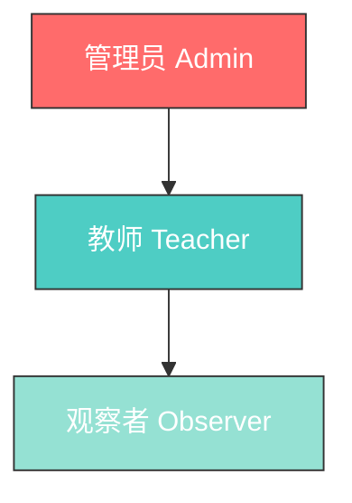

# 教师角色模型与权限矩阵

> 版本：v1.0  
> 日期：2026-04-30  
> 状态：已批准

---

## 1. 角色设计原则

1. **最小权限原则**：每个角色只拥有完成其职责所需的最小权限
2. **职责分离**：管理员、教师、观察者的职责明确分离
3. **可扩展性**：角色和权限设计支持未来扩展
4. **简单易懂**：角色层级清晰，便于学校管理

---

## 2. 角色定义

### 2.1 角色层级



### 2.2 角色详细说明

#### 管理员（Administrator）

**职责范围：**
- 学校级别的系统管理
- 教师账户管理
- 系统配置
- 数据导出与备份

**适用人员：**
- 学校教务主任
- 系统管理员
- 指定的高级教师

#### 教师（Teacher）

**职责范围：**
- 课堂活动管理
- 思维树创建与编辑
- 学生录音管理
- AI 生成内容审核

**适用人员：**
- 授课教师
- 助教

#### 观察者（Observer）

**职责范围：**
- 查看课堂活动
- 查看思维树
- 导出报告（只读）

**适用人员：**
- 学校领导
- 教研员
- 家长（可选）

---

## 3. 权限矩阵

### 3.1 权限分类

| 权限类别 | 权限代码 | 说明 |
|----------|----------|------|
| 用户管理 | `user:*` | 教师账户的增删改查 |
| 活动管理 | `activity:*` | 课堂活动的创建、编辑、删除 |
| 树管理 | `tree:*` | 思维树的创建、编辑、删除 |
| 录音管理 | `audio:*` | 录音的上传、删除、导出 |
| AI 审核 | `ai:review` | AI 生成内容的审核 |
| 数据导出 | `export:*` | 数据导出功能 |
| 系统设置 | `system:*` | 系统配置管理 |

### 3.2 完整权限矩阵

| 功能 | 管理员 | 教师 | 观察者 |
|------|--------|------|--------|
| **用户管理** | | | |
| 创建教师账户 | ✅ | ❌ | ❌ |
| 编辑教师信息 | ✅ | ❌ | ❌ |
| 禁用教师账户 | ✅ | ❌ | ❌ |
| 重置教师密码 | ✅ | ❌ | ❌ |
| 查看教师列表 | ✅ | ❌ | ❌ |
| **活动管理** | | | |
| 创建活动 | ✅ | ✅ | ❌ |
| 编辑活动 | ✅ | ✅（仅自己的） | ❌ |
| 删除活动 | ✅ | ✅（仅自己的） | ❌ |
| 查看活动列表 | ✅ | ✅（仅自己的） | ✅ |
| 查看活动详情 | ✅ | ✅（仅自己的） | ✅ |
| **树管理** | | | |
| 创建思维树 | ✅ | ✅ | ❌ |
| 编辑思维树 | ✅ | ✅（仅自己的） | ❌ |
| 删除思维树 | ✅ | ✅（仅自己的） | ❌ |
| 添加节点 | ✅ | ✅ | ❌ |
| 编辑节点 | ✅ | ✅（仅自己的） | ❌ |
| 删除节点 | ✅ | ✅（仅自己的） | ❌ |
| 查看思维树 | ✅ | ✅（仅自己的） | ✅ |
| **录音管理** | | | |
| 上传录音 | ✅ | ✅ | ❌ |
| 删除录音 | ✅ | ✅（仅自己的） | ❌ |
| 导出录音 | ✅ | ✅（仅自己的） | ❌ |
| 听录音 | ✅ | ✅（仅自己的） | ✅ |
| **AI 审核** | | | |
| 审核 AI 建议 | ✅ | ✅ | ❌ |
| 修改 AI 生成内容 | ✅ | ✅ | ❌ |
| 查看 AI 建议 | ✅ | ✅ | ✅ |
| **数据导出** | | | |
| 导出活动报告 | ✅ | ✅（仅自己的） | ✅ |
| 导出思维树图片 | ✅ | ✅（仅自己的） | ✅ |
| 导出全校数据 | ✅ | ❌ | ❌ |
| **系统设置** | | | |
| 修改系统配置 | ✅ | ❌ | ❌ |
| 查看系统日志 | ✅ | ❌ | ❌ |
| 管理 AI 模型配置 | ✅ | ❌ | ❌ |

---

## 4. 权限实现设计

### 4.1 权限数据模型

```typescript
// 角色定义
enum Role {
  ADMIN = 'admin',
  TEACHER = 'teacher',
  OBSERVER = 'observer'
}

// 权限定义
enum Permission {
  // 用户管理
  USER_CREATE = 'user:create',
  USER_READ = 'user:read',
  USER_UPDATE = 'user:update',
  USER_DELETE = 'user:delete',
  
  // 活动管理
  ACTIVITY_CREATE = 'activity:create',
  ACTIVITY_READ = 'activity:read',
  ACTIVITY_UPDATE = 'activity:update',
  ACTIVITY_DELETE = 'activity:delete',
  
  // 树管理
  TREE_CREATE = 'tree:create',
  TREE_READ = 'tree:read',
  TREE_UPDATE = 'tree:update',
  TREE_DELETE = 'tree:delete',
  
  // 录音管理
  AUDIO_UPLOAD = 'audio:upload',
  AUDIO_READ = 'audio:read',
  AUDIO_DELETE = 'audio:delete',
  AUDIO_EXPORT = 'audio:export',
  
  // AI 审核
  AI_REVIEW = 'ai:review',
  AI_READ = 'ai:read',
  
  // 数据导出
  EXPORT_OWN = 'export:own',
  EXPORT_SCHOOL = 'export:school',
  
  // 系统设置
  SYSTEM_CONFIG = 'system:config',
  SYSTEM_LOG = 'system:log'
}

// 角色权限映射
const ROLE_PERMISSIONS: Record<Role, Permission[]> = {
  [Role.ADMIN]: [
    // 管理员拥有所有权限
    ...Object.values(Permission)
  ],
  
  [Role.TEACHER]: [
    // 活动管理（仅自己的）
    Permission.ACTIVITY_CREATE,
    Permission.ACTIVITY_READ,
    Permission.ACTIVITY_UPDATE,
    Permission.ACTIVITY_DELETE,
    
    // 树管理（仅自己的）
    Permission.TREE_CREATE,
    Permission.TREE_READ,
    Permission.TREE_UPDATE,
    Permission.TREE_DELETE,
    
    // 录音管理（仅自己的）
    Permission.AUDIO_UPLOAD,
    Permission.AUDIO_READ,
    Permission.AUDIO_DELETE,
    Permission.AUDIO_EXPORT,
    
    // AI 审核
    Permission.AI_REVIEW,
    Permission.AI_READ,
    
    // 数据导出（仅自己的）
    Permission.EXPORT_OWN
  ],
  
  [Role.OBSERVER]: [
    // 只读权限
    Permission.ACTIVITY_READ,
    Permission.TREE_READ,
    Permission.AUDIO_READ,
    Permission.AI_READ,
    Permission.EXPORT_OWN
  ]
};
```

### 4.2 资源所有权检查

```typescript
// 资源所有权验证
interface OwnershipCheck {
  resourceType: 'activity' | 'tree' | 'audio';
  resourceId: string;
  requesterId: string;
  requesterRole: Role;
}

function checkOwnership(check: OwnershipCheck): boolean {
  // 管理员可以访问所有资源
  if (check.requesterRole === Role.ADMIN) {
    return true;
  }
  
  // 教师和观察者只能访问自己的资源
  // 实际实现需要查询数据库
  return isResourceOwner(check.resourceType, check.resourceId, check.requesterId);
}
```

### 4.3 权限检查中间件

```typescript
// 权限检查装饰器（FastAPI 示例）
def require_permission(permission: Permission):
    def decorator(func):
        @wraps(func)
        async def wrapper(*args, **kwargs):
            # 从 JWT 中获取用户信息
            current_user = get_current_user()
            
            # 检查角色权限
            if permission not in ROLE_PERMISSIONS[current_user.role]:
                raise HTTPException(status_code=403, detail="权限不足")
            
            # 检查资源所有权（如果需要）
            if requires_ownership_check(func):
                resource_id = kwargs.get('resource_id')
                if not check_ownership(current_user, resource_id):
                    raise HTTPException(status_code=403, detail="无权访问该资源")
            
            return await func(*args, **kwargs)
        return wrapper
    return decorator

# 使用示例
@app.post("/activities")
@require_permission(Permission.ACTIVITY_CREATE)
async def create_activity(activity: ActivityCreate):
    # 只有管理员和教师可以创建活动
    pass

@app.delete("/activities/{activity_id}")
@require_permission(Permission.ACTIVITY_DELETE)
async def delete_activity(activity_id: str):
    # 管理员可以删除任何活动，教师只能删除自己的
    pass
```

---

## 5. 角色分配规则

### 5.1 初始分配

| 场景 | 默认角色 | 说明 |
|------|----------|------|
| 学校首次注册 | 第一个用户为管理员 | 自动获得管理员权限 |
| 管理员创建教师 | 教师 | 管理员指定角色 |
| 邀请加入 | 观察者 | 默认最低权限 |

### 5.2 角色变更规则

| 操作 | 限制 |
|------|------|
| 教师 → 管理员 | 需要现有管理员操作 |
| 管理员 → 教师 | 需要其他管理员操作 |
| 任意 → 观察者 | 管理员可操作 |
| 观察者 → 教师 | 管理员可操作 |

### 5.3 管理员保护机制

- 每个学校至少保留 1 个管理员
- 管理员不能禁用自己的账户
- 最后一个管理员不能被降级

---

## 6. 扩展角色（未来）

### 6.1 可能的扩展角色

| 角色 | 说明 | 适用场景 |
|------|------|----------|
| 教研组长 | 可查看本组所有教师的活动 | 教研管理 |
| 年级主任 | 可查看本年级所有班级 | 年级管理 |
| 家长 | 可查看自己孩子的活动 | 家校互动 |

### 6.2 自定义权限（高级）

未来可支持学校自定义权限组合：

```typescript
interface CustomRole {
  id: string;
  schoolId: string;
  name: string;
  permissions: Permission[];
  isSystem: boolean; // 系统预设角色不可删除
}
```

---

## 7. 总结

| 设计要点 | 说明 |
|----------|------|
| 角色数量 | 3 个基础角色（管理员、教师、观察者） |
| 权限粒度 | 按功能模块细分，共 7 大类权限 |
| 资源隔离 | 教师和观察者只能访问自己的资源 |
| 扩展性 | 支持未来添加自定义角色 |
| 安全性 | 最小权限原则，管理员保护机制 |
