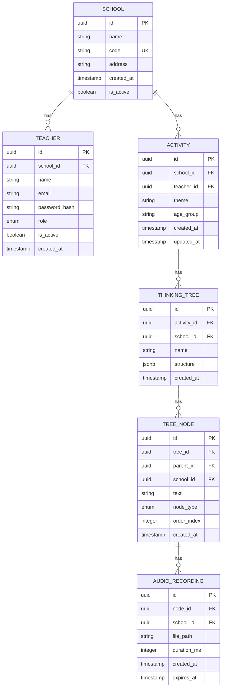

# 学校级数据隔离策略

> 版本：v1.0  
> 日期：2026-04-30  
> 状态：已批准

---

## 1. 背景

儿童思维树系统需要支持多学校部署，每个学校的数据（教师、活动、思维树、录音）必须严格隔离，确保：
- 学校 A 无法访问学校 B 的数据
- 教师只能访问自己学校的数据
- 管理员只能管理自己学校的数据

---

## 2. 多租户架构选型

### 2.1 方案对比

| 方案 | 隔离级别 | 优点 | 缺点 |
|------|----------|------|------|
| 独立数据库 | 数据库级 | 隔离性最强，备份恢复简单 | 成本高，运维复杂 |
| 共享数据库，独立 Schema | Schema 级 | 隔离性较好，成本适中 | 跨租户查询困难 |
| 共享数据库，共享 Schema | 行级 | 成本最低，运维简单 | 隔离性最弱，需要严格过滤 |

### 2.2 推荐方案：共享数据库 + 行级隔离

**选择理由：**

1. **成本效益**：学校数量有限（预计 100-500 所），共享数据库更经济
2. **运维简单**：统一备份、监控、升级
3. **开发效率**：单一代码库，减少重复逻辑
4. **扩展性**：未来可迁移到独立 Schema 或数据库

---

## 3. 数据模型设计

### 3.1 核心实体关系



### 3.2 学校 ID 字段

所有业务表都包含 `school_id` 字段：

```sql
-- 示例：活动表
CREATE TABLE activities (
    id UUID PRIMARY KEY DEFAULT gen_random_uuid(),
    school_id UUID NOT NULL REFERENCES schools(id),
    teacher_id UUID NOT NULL REFERENCES teachers(id),
    theme VARCHAR(100) NOT NULL,
    age_group VARCHAR(20) NOT NULL,
    created_at TIMESTAMP DEFAULT CURRENT_TIMESTAMP,
    updated_at TIMESTAMP DEFAULT CURRENT_TIMESTAMP
);

-- 索引
CREATE INDEX idx_activities_school_id ON activities(school_id);
CREATE INDEX idx_activities_teacher_id ON activities(teacher_id);
CREATE INDEX idx_activities_school_teacher ON activities(school_id, teacher_id);
```

---

## 4. 数据隔离实现

### 4.1 应用层隔离

#### 中间件方案

```typescript
// FastAPI 依赖注入
async def get_current_school(
    current_user: User = Depends(get_current_user)
) -> School:
    """从 JWT 中获取当前用户所属学校"""
    school = await get_school_by_id(current_user.school_id)
    if not school or not school.is_active:
        raise HTTPException(status_code=403, detail="学校不存在或已禁用")
    return school

// 数据访问层
class ActivityRepository:
    async def get_activities(
        self,
        school_id: UUID,
        teacher_id: Optional[UUID] = None
    ) -> List[Activity]:
        """查询活动，强制过滤 school_id"""
        query = select(Activity).where(Activity.school_id == school_id)
        
        if teacher_id:
            query = query.where(Activity.teacher_id == teacher_id)
        
        return await self.session.execute(query)
```

#### ORM 级别隔离

```typescript
// SQLAlchemy 事件监听
@event.listens_for(Session, "do_orm_execute")
def inject_school_filter(orm_execute_state):
    """自动注入 school_id 过滤条件"""
    if orm_execute_state.is_select:
        # 从上下文获取当前学校 ID
        school_id = get_current_school_id()
        
        # 自动添加过滤条件
        for entity in orm_execute_state.statement.column_descriptions:
            if hasattr(entity['entity'], 'school_id'):
                orm_execute_state.statement = orm_execute_state.statement.where(
                    entity['entity'].school_id == school_id
                )
```

### 4.2 数据库层隔离（可选增强）

#### 行级安全策略（PostgreSQL RLS）

```sql
-- 启用行级安全
ALTER TABLE activities ENABLE ROW LEVEL SECURITY;

-- 创建策略
CREATE POLICY school_isolation_policy ON activities
    USING (school_id = current_setting('app.current_school_id')::UUID);

-- 设置当前学校 ID
SET app.current_school_id = 'school-uuid-here';
```

### 4.3 API 层隔离

```typescript
// 路由级别隔离
@app.get("/api/v1/activities")
async def list_activities(
    school: School = Depends(get_current_school),
    teacher_id: Optional[UUID] = None
):
    """列出活动，自动过滤当前学校"""
    # 管理员可以查看所有教师的活动
    if current_user.role == Role.ADMIN:
        activities = await activity_repo.get_activities(school.id)
    else:
        # 教师只能查看自己的活动
        activities = await activity_repo.get_activities(
            school.id, 
            current_user.id
        )
    
    return activities

// 资源级别隔离
@app.get("/api/v1/activities/{activity_id}")
async def get_activity(
    activity_id: UUID,
    school: School = Depends(get_current_school)
):
    """获取活动详情，验证学校归属"""
    activity = await activity_repo.get_by_id(activity_id)
    
    if not activity or activity.school_id != school.id:
        raise HTTPException(status_code=404, detail="活动不存在")
    
    return activity
```

---

## 5. 文件存储隔离

### 5.1 存储结构

```
/storage
  /schools
    /{school_id}
      /audio
        /{activity_id}
          /{recording_id}.wav
      /exports
        /{export_id}.pdf
      /temp
        /{temp_file}.tmp
```

### 5.2 访问控制

```typescript
// 文件访问服务
class FileStorageService:
    async def get_audio_url(
        self,
        school_id: UUID,
        activity_id: UUID,
        recording_id: UUID
    ) -> str:
        """生成带签名的临时访问 URL"""
        # 验证资源归属
        recording = await self.get_recording(recording_id)
        if not recording or recording.school_id != school_id:
            raise ForbiddenError("无权访问该文件")
        
        # 生成临时 URL（有效期 1 小时）
        return generate_presigned_url(
            f"/storage/schools/{school_id}/audio/{activity_id}/{recording_id}.wav",
            expires_in=3600
        )
```

---

## 6. 缓存隔离

### 6.1 Redis 键命名规范

```
school:{school_id}:teacher:{teacher_id}  # 教师信息缓存
school:{school_id}:activity:{activity_id}  # 活动缓存
school:{school_id}:session:{session_id}  # 会话缓存
```

### 6.2 缓存访问控制

```typescript
// 缓存服务
class CacheService:
    async def get_teacher(
        self,
        school_id: UUID,
        teacher_id: UUID
    ) -> Optional[Teacher]:
        """获取教师缓存，强制 school_id 前缀"""
        key = `school:${school_id}:teacher:${teacher_id}`
        return await redis.get(key)
    
    async def set_teacher(
        self,
        school_id: UUID,
        teacher_id: UUID,
        teacher: Teacher
    ):
        """设置教师缓存，强制 school_id 前缀"""
        key = `school:${school_id}:teacher:${teacher_id}`
        await redis.setex(key, 3600, teacher)
```

---

## 7. 跨学校访问控制

### 7.1 禁止跨学校访问

默认情况下，禁止任何形式的跨学校访问：

```typescript
// 跨学校访问检查
def check_school_access(
    requester_school_id: UUID,
    resource_school_id: UUID
):
    if requester_school_id != resource_school_id:
        raise ForbiddenError("无权访问其他学校的数据")
```

### 7.2 特殊场景处理

| 场景 | 处理方式 |
|------|----------|
| 系统管理员 | 需要单独的系统级账户，不关联任何学校 |
| 数据迁移 | 通过管理后台，需要二次验证 |
| 数据导出 | 仅导出当前学校数据 |

---

## 8. 数据备份与恢复

### 8.1 备份策略

| 备份类型 | 频率 | 保留期 | 说明 |
|----------|------|--------|------|
| 全量备份 | 每天 | 30 天 | 整个数据库 |
| 增量备份 | 每小时 | 7 天 | 变更数据 |
| 学校级备份 | 按需 | 永久 | 单个学校数据 |

### 8.2 学校级备份实现

```sql
-- 导出单个学校数据
COPY (
    SELECT * FROM teachers WHERE school_id = 'school-uuid'
) TO '/backup/school-teachers.csv';

COPY (
    SELECT * FROM activities WHERE school_id = 'school-uuid'
) TO '/backup/school-activities.csv';
```

---

## 9. 性能优化

### 9.1 索引策略

```sql
-- 复合索引
CREATE INDEX idx_activities_school_teacher 
ON activities(school_id, teacher_id);

CREATE INDEX idx_trees_school_activity 
ON thinking_trees(school_id, activity_id);

-- 部分索引（仅活跃数据）
CREATE INDEX idx_active_teachers 
ON teachers(school_id, id) 
WHERE is_active = true;
```

### 9.2 查询优化

```typescript
// 避免 N+1 查询
async def get_activity_with_tree(activity_id: UUID):
    return await session.execute(
        select(Activity)
        .options(selectinload(Activity.tree))
        .where(Activity.id == activity_id)
    )
```

---

## 10. 监控与审计

### 10.1 访问日志

```typescript
// 访问日志记录
interface AccessLog {
    timestamp: Date;
    school_id: UUID;
    user_id: UUID;
    action: string;
    resource_type: string;
    resource_id: UUID;
    ip_address: string;
    user_agent: string;
}
```

### 10.2 异常检测

```typescript
// 跨学校访问检测
async def detect_cross_school_access(log: AccessLog):
    if log.school_id != get_user_school(log.user_id):
        await alert_admin(
            f"检测到跨学校访问：用户 {log.user_id} 尝试访问学校 {log.school_id} 的数据"
        )
```

---

## 11. 总结

| 设计要点 | 说明 |
|----------|------|
| 隔离方式 | 共享数据库 + 行级隔离 |
| 隔离字段 | 所有业务表包含 `school_id` |
| 隔离层级 | 应用层 + 数据库层（可选 RLS） |
| 文件隔离 | 按学校 ID 分目录存储 |
| 缓存隔离 | Redis 键包含 school_id 前缀 |
| 跨学校访问 | 默认禁止，特殊场景需审批 |
