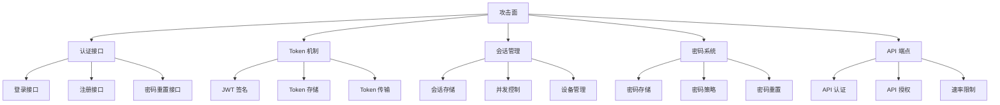
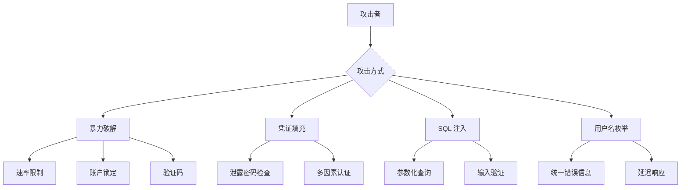
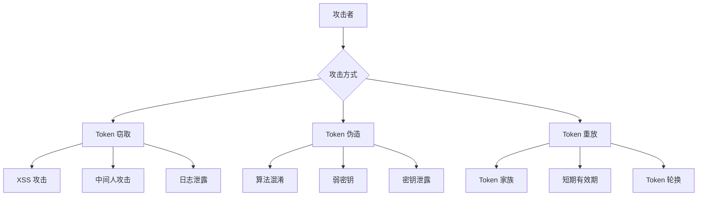
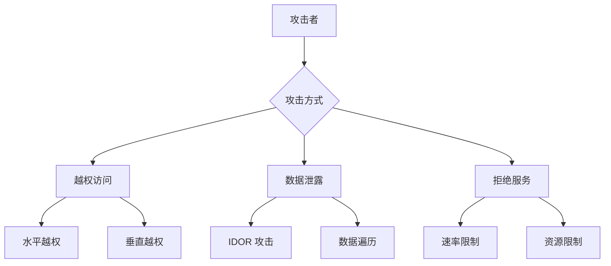
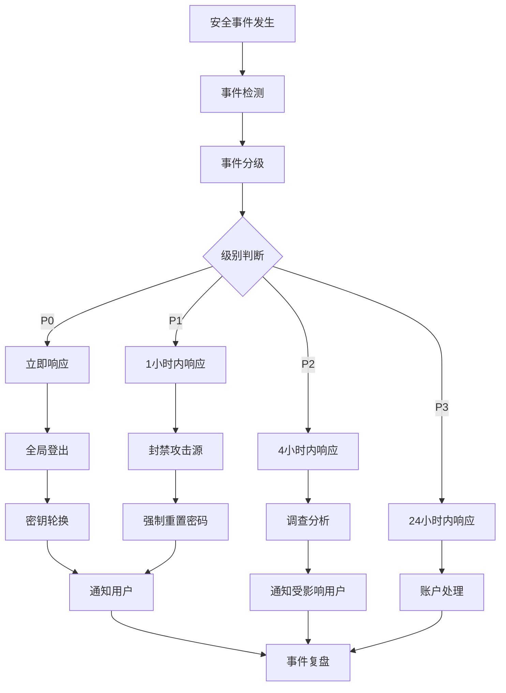

# 认证系统威胁模型

> 版本：v1.0  
> 日期：2026-04-30  
> 状态：已批准

---

## 1. 威胁建模方法

### 1.1 STRIDE 模型

采用 STRIDE 模型进行威胁分析：

| 威胁类型 | 说明 | 认证系统影响 |
|----------|------|--------------|
| **S**poofing (欺骗) | 假冒他人身份 | 伪造登录凭证 |
| **T**ampering (篡改) | 修改数据或代码 | 篡改 Token 或会话 |
| **R**epudiation (抵赖) | 否认做过某事 | 否认操作记录 |
| **I**nformation Disclosure (信息泄露) | 未授权访问信息 | 泄露用户凭证 |
| **D**enial of Service (拒绝服务) | 系统不可用 | 登录服务不可用 |
| **E**levation of Privilege (权限提升) | 获取未授权权限 | 越权访问 |

### 1.2 攻击面分析



---

## 2. 认证漏洞分析

### 2.1 暴力破解攻击

**威胁描述：**
攻击者通过尝试大量用户名/密码组合来破解账户。

**攻击向量：**
- 登录接口
- 密码重置接口
- API 认证接口

**风险等级：** 高

**缓解措施：**

| 措施 | 实现方式 | 有效性 |
|------|----------|--------|
| 速率限制 | 5 次/15 分钟 | 高 |
| 账户锁定 | 5 次失败后锁定 15 分钟 | 高 |
| 验证码 | 登录失败 3 次后显示 | 中 |
| IP 封禁 | 连续失败后封禁 IP | 中 |

**监控指标：**
- 登录失败次数
- 单 IP 失败次数
- 账户锁定次数

### 2.2 凭证填充攻击

**威胁描述：**
攻击者使用泄露的用户名/密码组合尝试登录。

**攻击向量：**
- 登录接口
- 使用已泄露的凭证数据库

**风险等级：** 中

**缓解措施：**

| 措施 | 实现方式 | 有效性 |
|------|----------|--------|
| 密码强度检查 | 注册时强制密码策略 | 高 |
| 泄露密码检查 | 对比 HaveIBeenPwned 数据库 | 高 |
| 多因素认证 | 支持 TOTP | 高 |
| 异常登录检测 | 检测异地登录 | 中 |

### 2.3 Token 窃取攻击

**威胁描述：**
攻击者窃取用户的 JWT Token 冒充用户。

**攻击向量：**
- XSS 攻击（窃取 LocalStorage）
- 中间人攻击（窃取网络传输）
- 日志泄露（Token 出现在日志中）

**风险等级：** 高

**缓解措施：**

| 措施 | 实现方式 | 有效性 |
|------|----------|--------|
| HttpOnly Cookie | Refresh Token 存储在 HttpOnly Cookie | 高 |
| 短期 Token | Access Token 有效期 15 分钟 | 高 |
| Token 黑名单 | 支持主动失效 | 高 |
| HTTPS 强制 | 所有通信使用 HTTPS | 高 |
| Token 轮换 | Refresh Token 使用后立即失效 | 中 |

### 2.4 JWT 签名攻击

**威胁描述：**
攻击者尝试伪造或篡改 JWT Token。

**攻击向量：**
- 算法混淆攻击（将 HS256 改为 none）
- 弱密钥攻击
- 密钥泄露

**风险等级：** 高

**缓解措施：**

| 措施 | 实现方式 | 有效性 |
|------|----------|--------|
| 算法白名单 | 只允许 HS256 | 高 |
| 强密钥 | 使用 256 位随机密钥 | 高 |
| 密钥轮换 | 定期更换密钥 | 中 |
| 密钥存储 | 环境变量，不提交到代码库 | 高 |

### 2.5 会话固定攻击

**威胁描述：**
攻击者强制用户使用已知的会话 ID。

**攻击向量：**
- 注入会话 ID 到用户浏览器
- 通过 URL 参数传递会话 ID

**风险等级：** 中

**缓解措施：**

| 措施 | 实现方式 | 有效性 |
|------|----------|--------|
| 登录后重新生成 Token | 每次登录生成新的 Token | 高 |
| 随机 Token ID | 使用 UUID 作为 jti | 高 |
| HttpOnly Cookie | 防止 JavaScript 访问 | 高 |

### 2.6 跨站请求伪造 (CSRF)

**威胁描述：**
攻击者诱导用户在已认证的情况下执行非预期操作。

**攻击向量：**
- 恶意网站发起请求
- 利用用户的 Cookie

**风险等级：** 中

**缓解措施：**

| 措施 | 实现方式 | 有效性 |
|------|----------|--------|
| SameSite Cookie | 设置 SameSite=Strict | 高 |
| CSRF Token | 表单提交需要 CSRF Token | 高 |
| 检查 Referer | 验证请求来源 | 中 |
| 自定义请求头 | API 请求需要自定义头 | 中 |

---

## 3. 攻击向量详细分析

### 3.1 登录接口攻击



### 3.2 Token 攻击



### 3.3 API 攻击



---

## 4. 缓解策略详细设计

### 4.1 密码安全策略

**密码要求：**
- 最小长度：8 位
- 必须包含：大写字母、小写字母、数字
- 不允许使用：常见密码、用户名、邮箱
- 密码历史：不允许使用最近 5 次的密码

**密码存储：**
```typescript
// bcrypt 配置
const SALT_ROUNDS = 12;

// 密码哈希
async function hashPassword(password: string): Promise<string> {
    return bcrypt.hash(password, SALT_ROUNDS);
}

// 密码验证
async function verifyPassword(password: string, hash: string): Promise<boolean> {
    return bcrypt.compare(password, hash);
}
```

### 4.2 JWT 安全配置

```typescript
// JWT 配置
const JWT_CONFIG = {
    algorithm: 'HS256',
    accessTokenExpiry: '15m',
    refreshTokenExpiry: '7d',
    issuer: 'thinking-tree',
    audience: 'thinking-tree-api'
};

// 密钥管理
const JWT_SECRET = process.env.JWT_SECRET_KEY; // 至少 256 位
const JWT_REFRESH_SECRET = process.env.JWT_REFRESH_SECRET_KEY; // 独立密钥
```

### 4.3 速率限制配置

```typescript
// 速率限制规则
const RATE_LIMITS = {
    login: {
        windowMs: 15 * 60 * 1000, // 15 分钟
        max: 5, // 最多 5 次
        message: '登录尝试过于频繁，请 15 分钟后再试'
    },
    passwordReset: {
        windowMs: 60 * 60 * 1000, // 1 小时
        max: 3, // 最多 3 次
        message: '密码重置请求过于频繁，请 1 小时后再试'
    },
    api: {
        windowMs: 60 * 1000, // 1 分钟
        max: 100, // 最多 100 次
        message: 'API 请求过于频繁，请稍后再试'
    }
};
```

### 4.4 会话安全配置

```typescript
// 会话配置
const SESSION_CONFIG = {
    maxConcurrentSessions: 3, // 最大并发会话数
    sessionTimeout: 30 * 60 * 1000, // 会话超时 30 分钟
    absoluteTimeout: 8 * 60 * 60 * 1000, // 绝对超时 8 小时
    renewOnActivity: true // 活动时续期
};
```

---

## 5. 安全测试要求

### 5.1 认证测试清单

| 测试类别 | 测试项 | 优先级 |
|----------|--------|--------|
| **密码安全** | 密码强度验证 | 高 |
| | 密码哈希验证 | 高 |
| | 密码历史检查 | 中 |
| **登录安全** | 暴力破解防护 | 高 |
| | 账户锁定机制 | 高 |
| | 用户名枚举防护 | 中 |
| **Token 安全** | JWT 签名验证 | 高 |
| | Token 过期处理 | 高 |
| | Token 黑名单 | 高 |
| **会话安全** | 并发会话控制 | 中 |
| | 会话超时 | 中 |
| | 强制登出 | 中 |
| **API 安全** | 权限检查 | 高 |
| | 资源隔离 | 高 |
| | 速率限制 | 中 |

### 5.2 渗透测试场景

**场景 1：暴力破解测试**
```
目标：验证登录接口的暴力破解防护
步骤：
1. 使用脚本连续发送 100 个登录请求
2. 验证是否触发速率限制
3. 验证账户是否被锁定
4. 验证锁定时间是否正确
预期结果：
- 第 6 个请求开始返回 429
- 账户在 5 次失败后被锁定
- 锁定 15 分钟后自动解锁
```

**场景 2：Token 窃取测试**
```
目标：验证 Token 窃取后的防护机制
步骤：
1. 获取有效的 Access Token
2. 使用该 Token 发起请求
3. 将 Token 加入黑名单
4. 再次使用该 Token 发起请求
预期结果：
- 正常 Token 可以访问
- 黑名单 Token 返回 401
- 用户被强制重新登录
```

**场景 3：越权访问测试**
```
目标：验证权限隔离机制
步骤：
1. 使用教师 A 的 Token 访问教师 B 的资源
2. 使用观察者 Token 尝试创建资源
3. 使用教师 Token 访问管理员接口
预期结果：
- 教师 A 无法访问教师 B 的资源
- 观察者无法创建资源
- 教师无法访问管理员接口
```

### 5.3 自动化安全测试

```typescript
// 安全测试示例（Jest）
describe('Authentication Security', () => {
    describe('Password Security', () => {
        it('should reject weak passwords', async () => {
            const weakPasswords = ['12345678', 'password', 'qwerty123'];
            for (const password of weakPasswords) {
                const result = await validatePassword(password);
                expect(result.valid).toBe(false);
            }
        });
        
        it('should hash passwords with bcrypt', async () => {
            const password = 'StrongPass123';
            const hash = await hashPassword(password);
            expect(hash).toMatch(/^\$2[ab]\$\d{2}\$/);
        });
    });
    
    describe('JWT Security', () => {
        it('should reject expired tokens', async () => {
            const expiredToken = generateExpiredToken();
            const result = await verifyToken(expiredToken);
            expect(result.valid).toBe(false);
            expect(result.error).toBe('TOKEN_EXPIRED');
        });
        
        it('should reject blacklisted tokens', async () => {
            const token = generateValidToken();
            await blacklistToken(token);
            const result = await verifyToken(token);
            expect(result.valid).toBe(false);
            expect(result.error).toBe('TOKEN_BLACKLISTED');
        });
    });
    
    describe('Rate Limiting', () => {
        it('should block after 5 failed login attempts', async () => {
            for (let i = 0; i < 5; i++) {
                await login('test@example.com', 'wrongpassword');
            }
            const result = await login('test@example.com', 'wrongpassword');
            expect(result.status).toBe(429);
        });
    });
});
```

---

## 6. 安全监控与告警

### 6.1 监控指标

| 指标 | 阈值 | 告警级别 |
|------|------|----------|
| 登录失败率 | > 10% | 警告 |
| 单 IP 失败次数 | > 50 次/小时 | 严重 |
| 账户锁定次数 | > 10 次/小时 | 警告 |
| Token 黑名单大小 | > 10000 | 警告 |
| 异地登录次数 | > 5 次/小时 | 警告 |

### 6.2 告警规则

```yaml
# Prometheus 告警规则
groups:
  - name: authentication
    rules:
      - alert: HighLoginFailureRate
        expr: rate(login_failures_total[5m]) > 0.1
        for: 5m
        labels:
          severity: warning
        annotations:
          summary: "登录失败率过高"
          
      - alert: BruteForceDetected
        expr: rate(login_failures_total{ip=~".+"}[5m]) > 10
        for: 1m
        labels:
          severity: critical
        annotations:
          summary: "检测到暴力破解攻击"
          
      - alert: AccountLockoutSpike
        expr: increase(account_lockouts_total[1h]) > 10
        for: 5m
        labels:
          severity: warning
        annotations:
          summary: "账户锁定次数异常"
```

### 6.3 日志记录

```typescript
// 安全日志格式
interface SecurityLog {
    timestamp: string;
    event: 'login_success' | 'login_failure' | 'logout' | 'password_change' | 
           'account_locked' | 'token_refresh' | 'permission_denied';
    userId?: string;
    schoolId?: string;
    ipAddress: string;
    userAgent: string;
    details?: {
        reason?: string;
        resourceId?: string;
        attemptedAction?: string;
    };
}
```

---

## 7. 应急响应计划

### 7.1 安全事件分级

| 级别 | 描述 | 响应时间 | 处理措施 |
|------|------|----------|----------|
| P0 | 密钥泄露、大规模数据泄露 | 立即 | 全局登出、密钥轮换 |
| P1 | 暴力破解攻击、账户接管 | 1 小时 | 封禁 IP、强制重置密码 |
| P2 | 异常登录模式 | 4 小时 | 调查、通知用户 |
| P3 | 单个账户异常 | 24 小时 | 调查、账户处理 |

### 7.2 应急响应流程



---

## 8. 总结

| 威胁类别 | 主要威胁 | 缓解措施 | 测试要求 |
|----------|----------|----------|----------|
| 暴力破解 | 登录接口攻击 | 速率限制、账户锁定 | 自动化测试 |
| 凭证填充 | 泄露凭证攻击 | 密码检查、多因素认证 | 渗透测试 |
| Token 窃取 | JWT 泄露 | HttpOnly、短期有效、黑名单 | 安全测试 |
| 会话固定 | 会话劫持 | 登录后重新生成 | 安全测试 |
| 越权访问 | 权限绕过 | 严格权限检查、资源隔离 | 自动化测试 |
| 拒绝服务 | 服务不可用 | 速率限制、资源限制 | 压力测试 |
