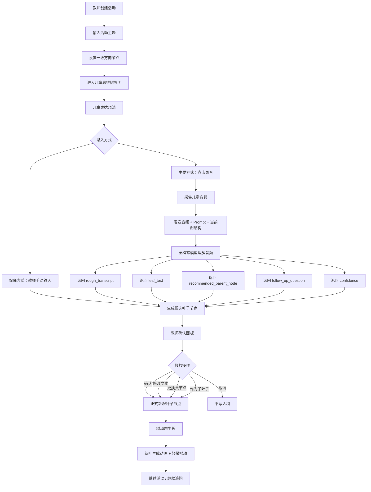
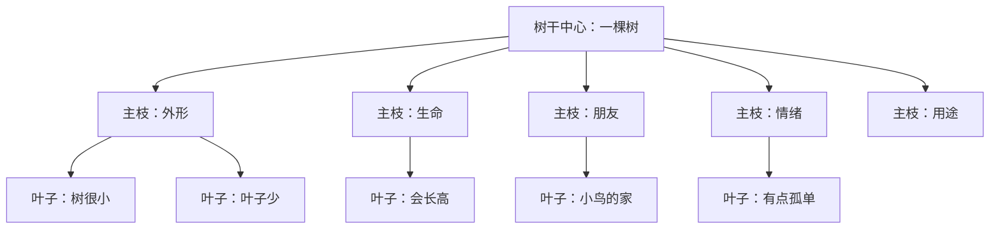
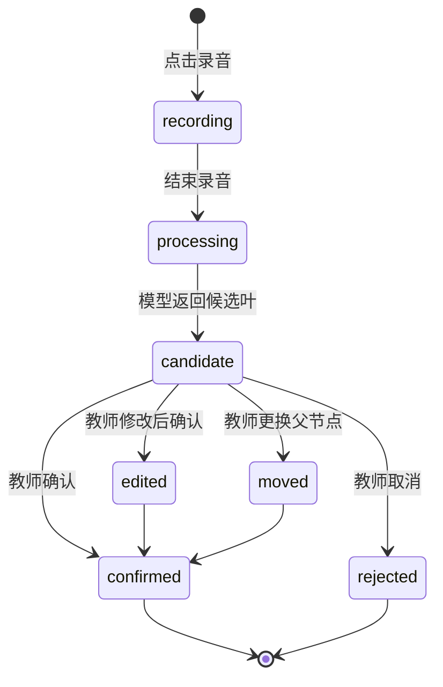
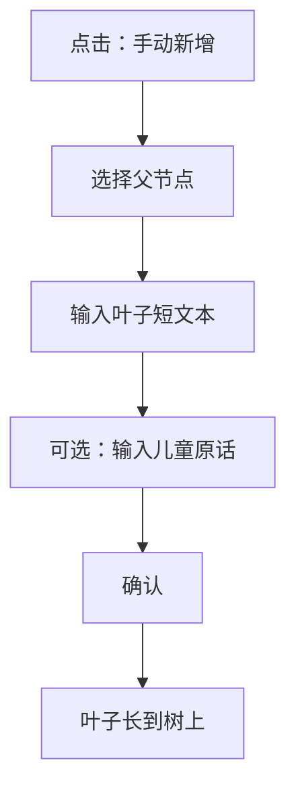
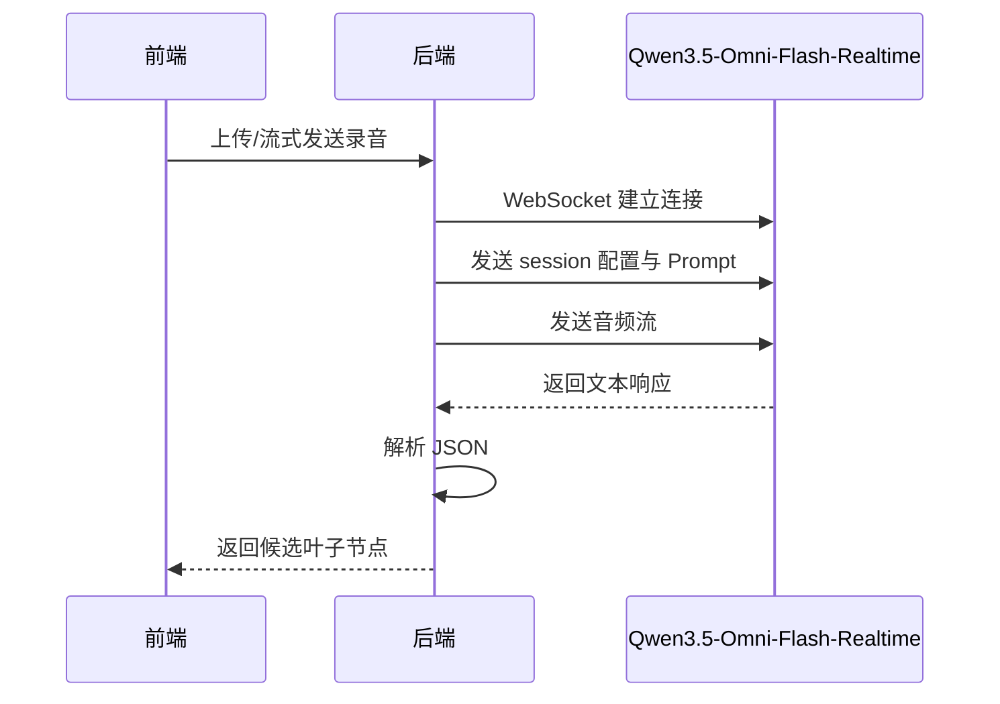
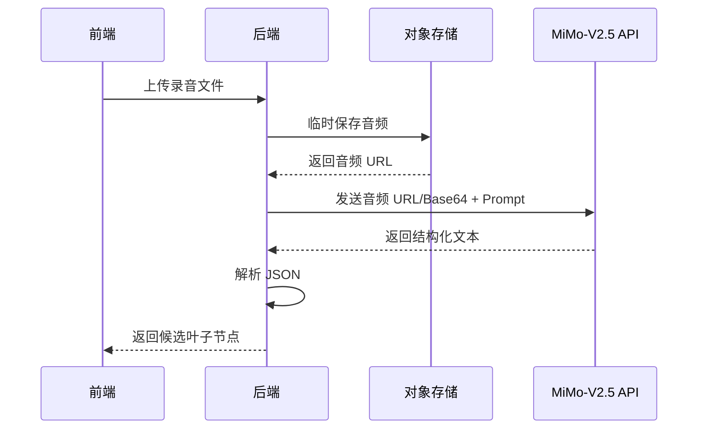

# 儿童思维树系统完整开发计划（Plan B：录音 + 全模态模型直接理解）

> 版本：v1.0  
> 目标：面向儿童课堂/活动场景，设计一个“教师可控、儿童参与、AI 辅助”的交互式思维拓展系统。  
> 核心路线：**教师点击录音 → 儿童说话 → 全模态模型直接理解音频 → 返回简短转写、叶子节点总结、推荐父节点、追问建议 → 教师确认 → 叶子长到树上**。

---

## 1. 项目定位

本系统不是传统思维导图工具，也不是简单的数据结构可视化工具，而是一个面向儿童表达与课堂互动的 **AI 辅助思维生长活动系统**。

系统以一棵动态生长的树作为核心隐喻：

- **根节点**：活动主题，例如“一棵树”“我的校园”“如果我是一只小鸟”。
- **一级方向节点**：教师提前设置的思考方向，例如“外形”“生命”“朋友”“情绪”“用途”“环境”。
- **下层叶子节点**：儿童自己的具体想法，由手动录入或录音 + 全模态模型自动生成候选节点。
- **更深层叶子节点**：围绕某个儿童想法继续追问后形成的细化表达。
- **树越来越茂盛**：象征儿童思维从单一到多元、从零散到结构化。

系统设计原则：

1. **儿童是表达主体**：AI 不替儿童想答案。
2. **教师拥有最终控制权**：AI 生成的节点必须经过教师确认。
3. **保留儿童原意**：树叶短文本应简洁，但不能成人化、不能过度加工。
4. **视觉上要像真实的树**：树干、枝条、树叶、风吹摇动、新叶生长动画都要服务于“思维生长”的隐喻。
5. **技术上采用 Plan B**：全模态模型直接接收录音，同时输出简短转写、总结、归类和追问建议。

---

## 2. 为什么采用 Plan B

### 2.1 Plan A 与 Plan B 对比

| 方案 | 流程 | 优点 | 缺点 |
|---|---|---|---|
| Plan A：ASR + LLM | 录音 → ASR 转文字 → LLM 总结归类 | 工程链路清晰，容易调试 | 用户感知上更像“转写工具”，流程更长 |
| Plan B：全模态模型直接理解 | 录音 + Prompt + 当前树结构 → 全模态模型直接输出结构化结果 | 产品体验自然，模型可结合上下文直接理解儿童表达 | 仍需返回简短转写，方便教师核对 |

本项目采用 **Plan B**：

> 前端不需要显式展示“先转写再总结”的技术流程，而是让全模态模型直接理解儿童录音，并返回结构化候选节点。

但为了教育场景中的可控性，系统仍会要求模型返回一个 `rough_transcript` 字段，即“简短转写/主要表达”，用于教师核对模型是否听对、理解对。

---

## 3. 可选全模态模型

本项目计划支持两个模型后端：

1. **Qwen3.5-Omni-Flash-Realtime**
2. **MiMo-V2.5**

二者都作为可配置的模型供应商接入，后端通过统一的 `ModelAdapter` 层屏蔽差异。

### 3.1 Qwen3.5-Omni-Flash-Realtime

适合场景：

- 低延迟录音理解；
- 课堂实时/准实时互动；
- 需要通过 WebSocket 进行音频流输入；
- 希望通过 Prompt 注入当前活动主题、方向节点和儿童年龄段上下文。

根据阿里云百炼文档，Qwen-Omni-Realtime 是实时音视频聊天模型，可以理解流式音频与图像输入，并实时输出文本与音频；该模型通过 WebSocket 协议接入。文档中的语音识别模型列表也将 `qwen3.5-omni-flash-realtime` 列为 Qwen3.5-Omni 的实时模型，并标注其为轻量版、低成本，支持 Prompt 上下文注入、情绪识别、不支持说话人分离，支持 113 种语言，最大时长 120 分钟。

### 3.2 MiMo-V2.5

适合场景：

- 音频文件/音频片段理解；
- 可能使用 URL 或 Base64 方式传入音频；
- 需要统一的文本、图像、视频、音频理解能力；
- 后期考虑本地部署、私有化部署或开源模型扩展。

小米 MiMo API 的音频理解文档说明，音频理解模型可以根据传入音频回答问题，支持 **音频 URL** 和 **Base64 编码** 两种传入方式。MiMo-V2.5 模型卡也说明该模型是 native omnimodal model，支持 Text、Image、Video、Audio 等模态，并具有统一架构和音频编码器。

### 3.3 模型选择建议

| 维度 | Qwen3.5-Omni-Flash-Realtime | MiMo-V2.5 |
|---|---|---|
| 使用方式 | 更偏实时 WebSocket | 更适合音频 URL/Base64 文件式输入 |
| 课堂即时互动 | 更适合 | 可用，但具体延迟取决于 API |
| Prompt 上下文注入 | 适合 | 适合 |
| 音频理解 | 支持 | 支持 |
| 输出结构化 JSON | 通过 Prompt 约束 | 通过 Prompt 约束 |
| 供应商 | 阿里云百炼 | Xiaomi MiMo API |
| 第一阶段建议 | 优先接入 | 作为第二供应商或备用方案 |

建议第一版：

> **先做统一模型适配层，默认接入 Qwen3.5-Omni-Flash-Realtime；同时预留 MiMo-V2.5 Adapter。**

---

## 4. 整体系统流程图



---

## 5. 树状 UI 设计目标

### 5.1 视觉定位

系统的核心界面应该像儿童绘本里的互动场景，而不是工程图或后台管理系统。

关键词：

- 自然；
- 温暖；
- 童趣；
- 手绘感；
- 有生命力；
- 可触摸、可探索；
- 树叶会轻轻动；
- 新想法像新叶子一样长出来。

### 5.2 UI 不应这样做

避免做成传统数据结构树：

```text
主题
├── 外形
│   ├── 它很小
│   └── 叶子很少
├── 生命
│   └── 它会长高
```

这种展示虽然清楚，但不适合儿童活动场景，缺乏“思维生长”的隐喻。

### 5.3 UI 应该这样设计



实际界面应表现为（可以按实际进行优化）：

- 背景是天空、草地、柔和光线；
- 根节点在树干中心或树根处；
- 一级方向节点是主枝上的大叶子或木牌；
- 儿童想法是枝干上的小叶子；
- 新增方向节点时，树上长出新枝干；
- 新增儿童想法时，枝干上长出新叶；
- 树叶在空闲状态轻微摇动；
- AI 候选叶子是半透明的，确认后才变为实心叶子；
- 低置信度节点可用浅黄色或小问号提示教师核对。

---

## 6. 主界面布局

```text
┌──────────────────────────────────────────────┐
│ 顶部栏：活动名 / 年龄段 / 保存 / 回顾 / 设置       │
├──────────────────────────────────────────────┤
│                                              │
│                 浅蓝天空背景                  │
│                                              │
│          🌿           🌿           🌿         │
│         外形         生命         朋友         │
│            \          |          /            │
│              \        |        /              │
│                 树干：一棵树                  │
│              /        |        \              │
│           情绪        用途       +新方向       │
│                                              │
│                 草地 / 树根区域                │
│                                              │
├──────────────────────────────────────────────┤
│ 底部工具栏：🎙录音 / ✍手动新增 / 🤖AI建议 / 回顾 │
└──────────────────────────────────────────────┘
```

---

## 7. 关键交互设计

### 7.1 录音交互

教师点击底部按钮：

```text
🎙 让小朋友说一说
```

录音状态：

```text
正在听小朋友说话……
● ● ● 声波动画
[结束录音]
```

模型返回后弹出候选卡片：

```text
🌱 AI 发现一个新想法

我听到小朋友说：
“它有点孤单，因为旁边没有别的树。”

建议长到：
情绪

树叶内容：
小树有点孤单

追问建议：
小树怎样才能不孤单呢？

[确认长出叶子] [修改文字] [换枝干] [作为子叶] [取消]
```

### 7.2 AI 候选叶子状态

AI 生成的叶子不能直接成为正式节点。

候选叶状态：

- 半透明；
- 带虚线边框；
- 轻微发光；
- 显示“待确认”；
- 教师确认后变成正式叶子。



### 7.3 手动保底录入

当模型不可用、识别不准、课堂太吵时，教师可以使用保底方式。

手动录入流程：



---

## 8. 树叶动画设计

### 8.1 空闲状态：微风摇动

每片叶子在空闲状态轻微摇动，模拟风吹树叶。

设计要点：

- 幅度小；
- 周期随机；
- 不影响文字阅读；
- 可在无障碍设置中关闭。

示例 CSS：

```css
.leaf {
  transform-origin: 50% 90%;
  animation: leaf-sway 4s ease-in-out infinite;
}

.leaf:nth-child(2n) {
  animation-duration: 4.8s;
  animation-delay: -1.2s;
}

.leaf:nth-child(3n) {
  animation-duration: 5.6s;
  animation-delay: -2.1s;
}

@keyframes leaf-sway {
  0% {
    transform: rotate(-1.5deg) translateY(0);
  }
  50% {
    transform: rotate(1.8deg) translateY(-1px);
  }
  100% {
    transform: rotate(-1.5deg) translateY(0);
  }
}

@media (prefers-reduced-motion: reduce) {
  .leaf {
    animation: none;
  }
}
```

### 8.2 新叶生成动画

教师确认后，新叶不应突然出现，而应“长出来”。

动画过程：

```text
小光点出现 → 叶芽变大 → 展开成叶片 → 轻微摇动
```

示例 CSS：

```css
.new-leaf {
  transform-origin: 50% 90%;
  animation: grow-leaf 0.8s ease-out forwards;
}

@keyframes grow-leaf {
  0% {
    opacity: 0;
    transform: scale(0.2) rotate(-8deg);
  }
  60% {
    opacity: 1;
    transform: scale(1.12) rotate(3deg);
  }
  100% {
    opacity: 1;
    transform: scale(1) rotate(0deg);
  }
}
```

### 8.3 方向枝干高亮

当教师选择某个方向节点，例如“生命”，该枝干应轻微发光：

```text
生命枝干高亮
该枝干下叶子变亮
底部提示：正在记录“生命”方向下的小朋友想法
```

### 8.4 树冠密度反馈

某个方向下叶子越多，这个方向越茂盛。

| 状态 | UI 表现 |
|---|---|
| 没有想法 | 枝干较空，出现“可以问问小朋友……”提示 |
| 少量想法 | 枝干上有几片叶子 |
| 想法丰富 | 枝干更茂盛，叶片层次增加 |
| 想法过密 | 自动收拢成叶簇，点击展开 |

---

## 9. 前端技术方案

推荐技术栈：

| 模块 | 技术 |
|---|---|
| 框架 | React / Next.js |
| 树可视化 | SVG + HTML Overlay |
| 动画 | CSS Animation + Framer Motion |
| 录音 | MediaRecorder API |
| 状态管理 | Zustand / Redux Toolkit |
| 请求 | fetch / axios |
| UI | 自定义组件为主 |
| 导出 | html-to-image / jsPDF |

### 9.1 为什么用 SVG + HTML Overlay

树形视觉建议采用两层结构：

```text
SVG 层：树干、枝干、曲线、叶子轮廓
HTML 层：文字、按钮、弹窗、编辑框
```

优点：

- SVG 适合画自然曲线枝干；
- HTML 更适合编辑文字和做复杂交互；
- 叶子既可以是 SVG shape，也可以是绝对定位的 HTML 节点；
- 后期做动画、点击、拖拽、缩放会更灵活；
- 比纯 Canvas 更容易处理可访问性和表单输入。

---

## 10. 后端技术方案

推荐后端：

- Python + FastAPI；
- 或 Node.js + NestJS。

考虑到 AI 接口适配、音频处理和后续实验记录，建议优先使用：

> **FastAPI + PostgreSQL + 对象存储**

### 10.1 后端模块

| 模块 | 作用 |
|---|---|
| Activity Service | 创建活动、读取活动、活动配置 |
| Tree Service | 新增节点、移动节点、删除节点、节点排序 |
| Audio Service | 接收录音、临时保存、转码 |
| AI Service | 调用 Qwen / MiMo 模型 |
| Review Service | 教师确认、修改、拒绝 |
| Export Service | 导出图片、PDF、活动报告 |
| Privacy Service | 音频删除、匿名化、授权记录 |

---

## 11. 模型适配层设计

为了兼容 Qwen3.5-Omni-Flash-Realtime 和 MiMo-V2.5，后端设计统一接口：

```ts
interface OmniAudioModelAdapter {
  analyzeChildSpeech(input: AnalyzeSpeechInput): Promise<AnalyzeSpeechOutput>;
}

interface AnalyzeSpeechInput {
  provider: "qwen" | "mimo";
  audio: {
    type: "url" | "base64" | "pcm_stream" | "file";
    data: string;
    mimeType?: string;
  };
  activity: {
    theme: string;
    ageGroup: string;
    directionNodes: Array<{
      id: string;
      name: string;
      description?: string;
    }>;
    existingLeafNodes: Array<{
      id: string;
      parentId: string;
      text: string;
    }>;
  };
  constraints: {
    leafTextMinChars: number;
    leafTextMaxChars: number;
    requireTeacherConfirmation: boolean;
  };
}

interface AnalyzeSpeechOutput {
  roughTranscript: string;
  recommendedParentNodeId: string | null;
  recommendedParentNodeName: string | null;
  leafText: string;
  confidence: "high" | "medium" | "low";
  reason: string;
  followUpQuestion: string;
  needNewDirection: boolean;
  suggestedNewDirection: string | null;
}
```

### 11.1 Qwen Adapter



### 11.2 MiMo Adapter



---

## 12. Prompt 设计

### 12.1 主 Prompt 模板

```text
你是一个儿童课堂活动中的思维整理助手。

你的任务不是替儿童生成答案，而是帮助教师理解儿童刚刚说的话，并把儿童表达整理成一个可以显示在“思维树”上的短叶子节点。

当前活动主题：
{{theme}}

儿童年龄段：
{{age_group}}

当前一级方向节点：
{{direction_nodes}}

当前已有儿童想法：
{{existing_leaf_nodes}}

请听儿童的录音，并完成以下任务：

1. 用简短文字转写儿童主要表达，允许不逐字还原，但不能改变儿童意思。
2. 从已有方向节点中选择最合适的父节点。
3. 将儿童表达总结为一个适合显示在树叶上的短句。
4. 叶子节点必须保留儿童原意，不能成人化，不能替儿童补充没有说过的内容。
5. 叶子文本控制在 6-12 个中文字符，最多不超过 15 个中文字符。
6. 如果儿童表达中出现了当前方向节点无法覆盖的新角度，请不要直接新增方向节点，只返回 need_new_direction=true，并给出 suggested_new_direction。
7. 给出一个适合教师继续追问儿童的问题，问题要简单、亲切，适合 {{age_group}} 岁儿童。
8. 如果听不清、无法判断归类或存在多个可能父节点，请返回 confidence=low 或 medium，并说明需要教师确认。
9. 严格输出 JSON，不要输出 Markdown，不要输出解释性段落。

输出格式如下：

{
  "rough_transcript": "",
  "recommended_parent_node_id": "",
  "recommended_parent_node_name": "",
  "leaf_text": "",
  "confidence": "high | medium | low",
  "reason": "",
  "follow_up_question": "",
  "need_new_direction": false,
  "suggested_new_direction": ""
}
```

### 12.2 示例输入

```json
{
  "theme": "一棵树",
  "age_group": "4-6",
  "direction_nodes": [
    {"id": "direction_appearance", "name": "外形"},
    {"id": "direction_life", "name": "生命"},
    {"id": "direction_friend", "name": "朋友"},
    {"id": "direction_emotion", "name": "情绪"},
    {"id": "direction_use", "name": "用途"}
  ],
  "existing_leaf_nodes": [
    {"id": "leaf_001", "parentId": "direction_appearance", "text": "树很小"},
    {"id": "leaf_002", "parentId": "direction_life", "text": "小树会长高"}
  ]
}
```

### 12.3 示例输出

```json
{
  "rough_transcript": "它有点孤单，因为旁边没有别的树",
  "recommended_parent_node_id": "direction_emotion",
  "recommended_parent_node_name": "情绪",
  "leaf_text": "小树有点孤单",
  "confidence": "high",
  "reason": "儿童主要表达了对小树情绪状态的想象",
  "follow_up_question": "小树怎样才能不孤单呢？",
  "need_new_direction": false,
  "suggested_new_direction": ""
}
```

---

## 13. 数据结构设计

### 13.1 Activity

```json
{
  "id": "activity_001",
  "title": "小树会怎么长大",
  "theme": "一棵树",
  "age_group": "4-6",
  "created_by": "teacher_001",
  "created_at": "2026-04-30T10:00:00Z",
  "model_provider": "qwen",
  "audio_retention_policy": "delete_after_processing"
}
```

### 13.2 TreeNode

```json
{
  "id": "node_001",
  "activity_id": "activity_001",
  "parent_id": null,
  "type": "theme",
  "text": "一棵树",
  "level": 0,
  "position": {
    "x": 500,
    "y": 620
  },
  "style": {
    "shape": "trunk",
    "color": "#8B5A2B"
  },
  "created_by": "teacher",
  "created_at": "2026-04-30T10:00:00Z"
}
```

节点类型：

| 类型 | 含义 |
|---|---|
| `theme` | 根节点 / 活动主题 |
| `direction` | 一级方向节点 |
| `thought` | 儿童想法叶子节点 |
| `detail` | 细化叶子节点 |
| `ai_candidate` | AI 候选叶子节点 |

### 13.3 SpeechRecord

```json
{
  "id": "speech_001",
  "activity_id": "activity_001",
  "audio_url": "optional/audio/path.wav",
  "rough_transcript": "它有点孤单，因为旁边没有别的树",
  "ai_summary": "小树有点孤单",
  "recommended_parent_id": "direction_emotion",
  "confidence": "high",
  "follow_up_question": "小树怎样才能不孤单呢？",
  "teacher_action": "confirmed",
  "final_node_id": "leaf_003",
  "created_at": "2026-04-30T10:05:00Z"
}
```

### 13.4 TeacherReview

```json
{
  "id": "review_001",
  "speech_record_id": "speech_001",
  "original_leaf_text": "小树有点孤单",
  "final_leaf_text": "小树很孤单",
  "original_parent_id": "direction_emotion",
  "final_parent_id": "direction_emotion",
  "action": "edited_and_confirmed",
  "reviewed_by": "teacher_001",
  "reviewed_at": "2026-04-30T10:06:00Z"
}
```

---

## 14. API 设计

### 14.1 活动 API

```http
POST /api/activities
GET /api/activities/:activityId
PATCH /api/activities/:activityId
DELETE /api/activities/:activityId
```

### 14.2 树节点 API

```http
POST /api/activities/:activityId/nodes
PATCH /api/nodes/:nodeId
DELETE /api/nodes/:nodeId
POST /api/nodes/:nodeId/move
```

### 14.3 录音分析 API

```http
POST /api/activities/:activityId/speech/analyze
```

请求：

```json
{
  "provider": "qwen",
  "audio": {
    "type": "base64",
    "data": "base64-audio-data",
    "mimeType": "audio/wav"
  },
  "selectedParentNodeId": null
}
```

响应：

```json
{
  "speechRecordId": "speech_001",
  "candidate": {
    "roughTranscript": "它有点孤单，因为旁边没有别的树",
    "recommendedParentNodeId": "direction_emotion",
    "recommendedParentNodeName": "情绪",
    "leafText": "小树有点孤单",
    "confidence": "high",
    "reason": "儿童主要表达了情绪想象",
    "followUpQuestion": "小树怎样才能不孤单呢？",
    "needNewDirection": false,
    "suggestedNewDirection": null
  }
}
```

### 14.4 教师确认 API

```http
POST /api/speech-records/:speechRecordId/confirm
```

请求：

```json
{
  "finalLeafText": "小树有点孤单",
  "finalParentNodeId": "direction_emotion",
  "asChildOfLeafId": null
}
```

响应：

```json
{
  "node": {
    "id": "leaf_003",
    "type": "thought",
    "text": "小树有点孤单",
    "parent_id": "direction_emotion"
  }
}
```

---

## 15. 数据库表设计

### 15.1 activities

| 字段 | 类型 | 说明 |
|---|---|---|
| id | uuid | 活动 ID |
| title | text | 活动名称 |
| theme | text | 活动主题 |
| age_group | text | 儿童年龄段 |
| created_by | uuid | 教师 ID |
| model_provider | text | qwen / mimo |
| audio_retention_policy | text | 音频保留策略 |
| created_at | timestamp | 创建时间 |

### 15.2 tree_nodes

| 字段 | 类型 | 说明 |
|---|---|---|
| id | uuid | 节点 ID |
| activity_id | uuid | 活动 ID |
| parent_id | uuid/null | 父节点 |
| type | text | theme / direction / thought / detail |
| text | text | 节点文本 |
| level | int | 层级 |
| x | float | UI 坐标 |
| y | float | UI 坐标 |
| style_json | jsonb | 样式 |
| created_by | text | teacher / ai |
| created_at | timestamp | 创建时间 |

### 15.3 speech_records

| 字段 | 类型 | 说明 |
|---|---|---|
| id | uuid | 语音记录 ID |
| activity_id | uuid | 活动 ID |
| audio_url | text/null | 音频地址，可为空 |
| rough_transcript | text | 简短转写 |
| ai_summary | text | AI 生成叶子文本 |
| recommended_parent_id | uuid/null | 推荐父节点 |
| confidence | text | high / medium / low |
| follow_up_question | text | 追问建议 |
| raw_model_output | jsonb | 原始模型输出 |
| teacher_action | text | confirmed / edited / rejected |
| final_node_id | uuid/null | 最终节点 ID |
| created_at | timestamp | 创建时间 |

---

## 16. 隐私与儿童数据保护

因为系统处理儿童录音，必须将隐私保护作为核心设计。

建议规则：

1. **默认不长期保存原始音频**  
   录音仅用于生成候选节点，处理后自动删除。

2. **只保存教师确认后的文本节点**  
   保存内容包括叶子短文本、可选简短转写、教师修改记录。

3. **如果需要保存音频，必须显式授权**  
   需要学校或监护人授权，并在活动设置中开启。

4. **不做人脸识别、声纹识别或身份识别**  
   系统目标是思维表达记录，不是识别儿童身份。

5. **教师最终确认机制**  
   AI 生成内容不能绕过教师直接进入树。

6. **低置信度提醒**  
   当模型听不清或归类不确定时，必须提示教师人工判断。

7. **数据导出可匿名化**  
   导出报告时默认不包含儿童真实姓名。

---

## 17. 开发阶段规划

### 阶段 1：MVP 手动树

目标：先证明树状活动逻辑成立。

功能：

- 创建活动；
- 设置主题；
- 设置固定方向节点；
- 手动新增方向节点；
- 手动新增叶子节点；
- 叶子节点继续细分；
- 基础树 UI；
- 保存和读取活动。

验收标准：

- 教师可以不用 AI，也能完成一次完整活动；
- 树可以随着儿童想法手动增长；
- 节点可以增删改移动；
- UI 初步像树，而不是普通列表。

---

### 阶段 2：Plan B 录音 + 全模态模型

目标：实现主交互。

功能：

- 点击录音；
- 上传音频；
- 调用 Qwen3.5-Omni-Flash-Realtime；
- 预留 MiMo-V2.5；
- 返回 `rough_transcript`；
- 返回 `leaf_text`；
- 返回推荐父节点；
- 返回追问建议；
- 教师确认后写入树。

验收标准：

- 教师录一段儿童发言；
- 系统能返回候选叶子；
- 教师可确认、修改、换父节点、取消；
- 确认后叶子长到树上。

---

### 阶段 3：树的视觉升级

目标：让系统真正像儿童活动空间。

功能：

- 手绘树干；
- 自然曲线枝干；
- 叶片形状节点；
- 微风摇动动画；
- 新叶生长动画；
- 方向枝干高亮；
- AI 候选叶半透明；
- 树冠密度变化；
- 低想法方向提示。

验收标准：

- 视觉上能明显看出是一棵树；
- 新叶出现有“生长感”；
- 空闲时叶子轻微摇动；
- 节点文字仍然清楚可读。

---

### 阶段 4：AI 教师助手

目标：让 AI 不只是记录，还能辅助引导。

功能：

- 针对某片叶子生成追问；
- 针对空枝干生成引导问题；
- 识别重复叶子；
- 建议合并相似想法；
- 教师手动触发“是否需要新方向”；
- AI 建议新方向，教师确认后新增。

验收标准：

- AI 的建议不自动改变树；
- 教师可以选择采纳或忽略；
- 追问语言适合儿童年龄段。

---

### 阶段 5：回顾与导出

目标：形成课堂成果。

功能：

- 最终思维树截图；
- 每个方向的儿童想法列表；
- 活动过程记录；
- 教师观察记录；
- 导出 PNG / PDF / Markdown；
- 自动生成活动总结。

验收标准：

- 活动结束后可以保存成果；
- 教师可用于汇报、教研或儿童成长记录；
- 导出内容清楚、美观。

---

## 18. MVP 优先级

### 第一优先级：必须做

```text
1. 创建活动主题
2. 创建方向节点
3. 手动新增叶子
4. 树状 UI 展示
5. 保存和读取活动
6. 基础编辑：修改、删除、移动节点
```

### 第二优先级：Plan B 主链路

```text
7. 点击录音
8. 音频上传
9. 调用全模态模型
10. 返回 rough_transcript + leaf_text + parent_node
11. 教师确认
12. 叶子长到树上
```

### 第三优先级：体验增强

```text
13. 树叶摇动动画
14. 新叶生长动画
15. AI 追问建议
16. AI 建议新增方向
17. 活动总结导出
```

---

## 19. 风险与应对

| 风险 | 表现 | 应对 |
|---|---|---|
| 儿童语音听不清 | 模型转写错误 | 返回 rough_transcript，教师确认 |
| 课堂太吵 | 识别失败 | 保留手动新增叶子方案 |
| AI 总结成人化 | 叶子文本不符合儿童表达 | Prompt 强约束 + 教师可修改 |
| 归类错误 | 挂错方向节点 | 教师可更换父节点 |
| 节点过多 | 树冠混乱 | 叶簇折叠、缩放、分层显示 |
| 动画干扰阅读 | 树叶晃动太强 | 降低幅度，支持关闭动画 |
| 隐私风险 | 儿童录音被长期保存 | 默认处理后删除音频 |
| API 供应商变动 | 某模型不可用 | 统一 ModelAdapter，支持替换供应商 |

---

## 20. 最终项目表述

本系统是一个面向儿童课堂活动的 AI 辅助思维拓展工具。系统以一棵动态生长的树作为核心界面隐喻：根节点代表活动主题，主枝代表教师预设或后续新增的思考方向，树叶代表儿童自己的具体想法。教师可以通过手动输入或点击录音的方式采集儿童表达。在录音模式下，系统采用全模态大模型直接理解儿童语音，并返回简短转写、候选叶子节点、推荐父节点、置信度和追问建议。所有 AI 生成内容都需要经过教师确认后才会写入树中。随着活动进行，儿童的想法不断长成新的叶子，树也逐渐变得茂盛，从而直观呈现儿童思维从单一到多元、从零散到结构化的生长过程。

---

## 21. 参考资料

1. 阿里云百炼：Qwen-Omni-Realtime 文档  
   https://help.aliyun.com/zh/model-studio/realtime

2. 阿里云百炼：Realtime API 客户端事件  
   https://help.aliyun.com/zh/model-studio/client-events

3. 阿里云百炼：语音识别模型列表与 Qwen3.5-Omni 说明  
   https://help.aliyun.com/zh/model-studio/asr-model/

4. Xiaomi MiMo API：音频理解  
   https://platform.xiaomimimo.com/docs/zh-CN/usage-guide/multimodal-understanding/audio-understanding

5. Xiaomi MiMo-V2.5 Hugging Face Model Card  
   https://huggingface.co/XiaomiMiMo/MiMo-V2.5

